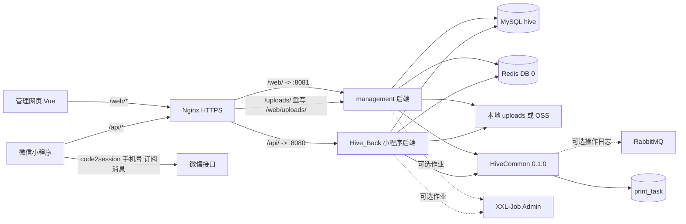
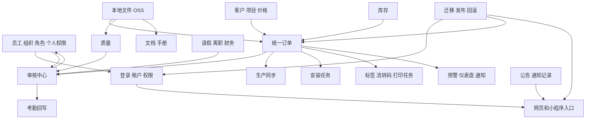
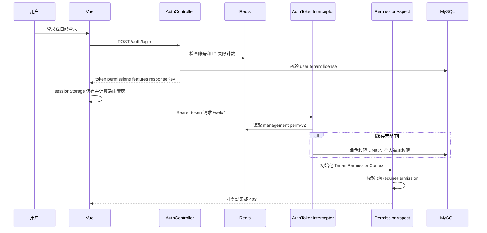
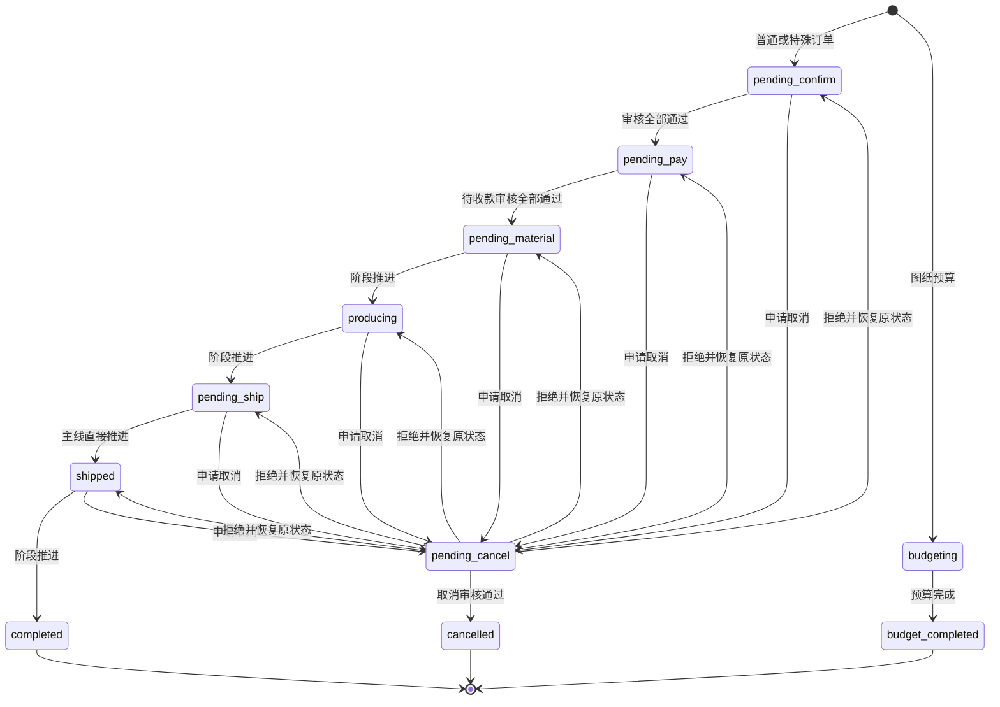
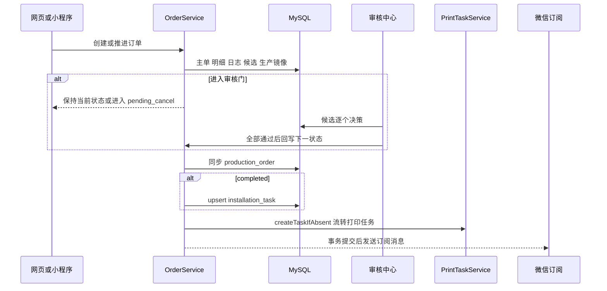
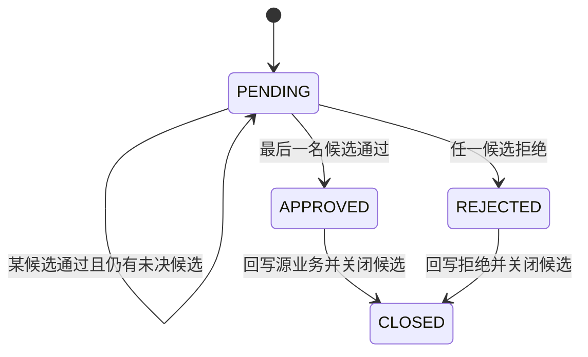
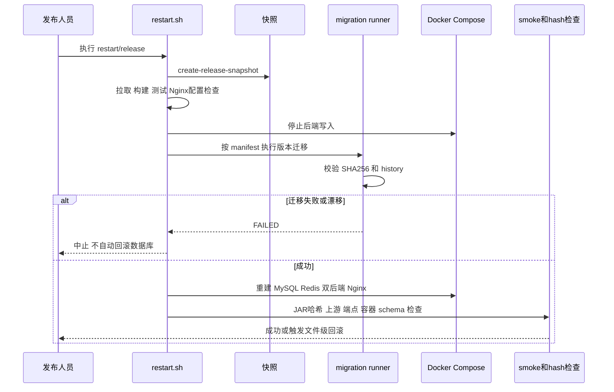

# Hive 系统逻辑链路总账

> 基线日期：2026-07-13。本文是源码与部署包的可检索总账，不代表尚未集成分支已经上线。

## 0. 使用说明与证据边界

### 0.1 状态词

| 标记 | 含义 |
| --- | --- |
| `主线已实现` | 在本次只读检查的主目录源码中存在；仍不等同于生产环境已部署。 |
| `部署包存在` | 在 `C:/Users/HUAWEI/Desktop/hive部署_全新配置` 中存在制品、脚本或迁移；未取得线上执行记录。 |
| `已提交待集成` | 只在指定最新工作树的提交中存在，不能视为主线或线上能力。 |
| `进行中` | 工作树有未提交修改或审查修复，接口、字段和测试仍可能变化。 |
| `缺失` | 在列明的检索范围中未找到实现。 |
| `待确认` | 源码不足以证明运行事实，或需要数据库/线上日志/微信后台等外部证据。 |

### 0.2 仓库基线

| 范围 | 本次基线 | 结论 |
| --- | --- | --- |
| 管理端后端/网页 | `D:/HiveManager`，分支 `dev`，文档提交前业务审计基线 HEAD `585141a` | 本文的管理端主线事实来源。工作区另有他人未提交文件，本文未修改、未回退。 |
| 小程序后端 | `D:/HiveBackend/server`，`dev`，HEAD `84fbbb0` | 本文的小程序后端主线事实来源。 |
| 小程序前端 | `D:/productHiveFrontend`，HEAD `9ae199e` | 当前工作区存在 `client/tests/*.test.js` 未提交删除；源码页面仍按实际文件检查。 |
| 公共模块 | `D:/HiveCommon/hive-backend-common`，版本 `0.1.0` | 两个后端共同依赖的权限、租户、打印、日志、存储等基础能力。 |
| 部署包 | `C:/Users/HUAWEI/Desktop/hive部署_全新配置` | 只证明候选部署包内容，不证明生产已执行。 |
| `informationChannel` 管理后端 | `D:/HiveWorktrees/info-channel-management-backend`，HEAD `efdc415` | 已有功能提交，当前有未提交 mapper/service/validation/test 审查修复，整体按 **进行中**。 |
| `informationChannel` 管理网页 | `D:/HiveWorktrees/info-channel-management-ui`，HEAD `01001b5` | 已有功能提交，当前有未提交页面、`orderFlow.js` 和测试审查修复，整体按 **进行中**。 |
| `informationChannel` 小程序后端 | `D:/HiveWorktrees/info-channel-mini-backend`，HEAD `1c9455c` | 工作树 clean，功能 **已提交待集成**；该工作树本地全量 `mvn test` 71/71（事实更新时间 2026-07-13）。 |
| `informationChannel` 小程序前端 | `D:/HiveWorktrees/info-channel-mini-frontend`，HEAD `0f70973` | **已提交待集成**。 |
| 发布改造 | `D:/HiveWorktrees/info-channel-deployment`，HEAD `3acee0f` | 迁移守卫/演练 **已提交待集成**；标准 `management-ui` cwd 的 13 个相关 Node 测试全绿，MySQL 8 rehearsal 因本机无 Docker 而 skip。 |

未找到 `AGENTS.md`：检索了上述六个主目录和五个指定工作树。已复用 `docs/management-ui/modules/*.md`、部署包 `docs/*.md`、迁移 README、设计与计划中的已有事实；最终结论仍以源码/脚本为准。

### 0.3 关键源码导航

| 逻辑层 | 入口 |
| --- | --- |
| 管理网页路由与置灰 | `management-ui/src/router/index.js`、`management-ui/src/layout/components/Sidebar.vue`、`management-ui/src/utils/access.js` |
| 管理后端 Controller | `management/src/main/java/my/management/controller/` |
| 小程序页面与请求 | `D:/productHiveFrontend/client/app.json`、`D:/productHiveFrontend/client/pages/`、`D:/productHiveFrontend/client/utils/request.js` |
| 小程序后端 Controller | `D:/HiveBackend/server/src/main/java/my/hive_back/api/` |
| 公共鉴权/租户/打印 | `D:/HiveCommon/hive-backend-common/src/main/java/my/hive/common/` |
| 表结构与版本迁移 | `C:/Users/HUAWEI/Desktop/hive部署_全新配置/db-migrations/` |
| 发布/回滚 | `C:/Users/HUAWEI/Desktop/hive部署_全新配置/scripts/` |

## 1. 总体运行架构

### 1.1 Nginx 与进程职责

| 链路 | 已核实行为 | 失败行为/待确认 |
| --- | --- | --- |
| `/`、`/assets/` | `nginx/nginx.conf` 提供管理网页 `dist`，SPA 回退。 | 静态制品缺失时页面 404/空白；由发布完整性检查发现。 |
| `/web/` | 代理 `management-backend-1:8081`；管理后端 context path `/web`。 | 上游不可用返回网关错误。 |
| `/api/` | 代理 `backend-1:8080`；小程序后端 context path `/api`。 | 上游不可用返回网关错误。 |
| `/uploads/` | 重写为管理后端 `/web/uploads/...`；公共模块校验租户上传路径。 | 路径越界、不存在或非普通文件拒绝；OSS URL 不走本地映射。 |
| `/health` | HTTP 直接 200；其余 HTTP 重定向 HTTPS。 | 这里只证明 Nginx 活着；后端/DB 由 smoke 脚本另查。 |
| 管理后端 | 管理网页 API、员工/角色/租户、统一订单、审核、仪表盘、通知闭环、文件管理。 | 不是小程序专属微信登录入口。 |
| 小程序后端 | 小程序 API、微信登录/手机号、扫码流转、移动考勤、订阅消息。 | 管理网页不得直接依赖 `/api` 的页面契约。 |

两个后端在部署包中共享 MySQL 数据库 `hive` 与 Redis DB 0，因此表字段、状态枚举、缓存命名和事务外副作用必须跨仓库协同。文件存储由公共模块的本地/OSS resolver 决定；微信和阿里云短信均为外部可选配置。RabbitMQ 只承接公共操作日志，可失败降级到本机内存队列；XXL-Job 组件是 compose profile，可选启用。

### 1.2 模块依赖

## 2. 登录、租户与权限完整链路

### 2.1 管理网页登录与二次鉴权

| 环节 | 源码/数据 | 规则、缓存与失败 |
| --- | --- | --- |
| 登录 | `management-ui/src/views/Login.vue` -> `POST /auth/login` -> `AuthController.login` -> `AuthService.login` -> `user`、`tenant`、角色权限关联表 | 账号/IP 失败计数达到阈值锁定；成功清除计数。token 续期通过响应头下发。 |
| 密码/加入组织 | `/auth/password-reset/code`、`/auth/password-reset`、`/auth/join-organization/code`、`/auth/join-organization`、`/auth/initial-password` | Redis 验证码、发送锁、失败计数；加入组织在事务内复用/创建员工、扩展资料和默认角色。短信未配置/发送失败时业务失败。 |
| 网页扫码登录 | `/auth/scan-login/session\|status\|confirm`；小程序首页使用 `requestUtil.postWeb('/auth/scan-login/confirm')` | `cache:auth:web-scan-login:{sceneKey}`，180 秒，`PENDING -> CONFIRMED -> USED`；过期、重复消费或用户/租户不匹配失败。 |
| 前端入口 | `router/index.js`、`Sidebar.vue`、`utils/access.js` | feature 或 permission 缺失时菜单置灰；直接导航由 router guard 转 `/no-permission`。平台租户只可进入 `/function/tenant`。 |
| 后端认证 | `AuthTokenInterceptor`、`PlatformScopeInterceptor` | Bearer 无效 401；租户不在 allow-list、许可证过期/停用 403；平台账号越界 403。 |
| 后端权限 | 公共 `PermissionAspect` + `@RequirePermission` | 注解中的任一权限满足即可；业务 Service 仍会检查订单阶段、审核候选人、源状态等前置条件。 |
| effective permissions | `AuthMapper.selectPermCodesByUserIdAndTenantCode` | `sys_user_role -> sys_role -> sys_role_permission -> sys_permission` 与 `sys_user_permission` 合并。个人 `DENY` 以 `!perm` 表示并优先于精确/通配 GRANT。 |
| 权限缓存 | `hive:{env}:cache:management:perm-v2:{tenant}:{user}`，TTL 30 分钟 | 角色或个人权限更新须同时删除 management/mini 两端 key；Redis 异常时回源 DB/记录日志，具体调用点见 `PermissionCacheUtil`。 |
| feature | `tenant` 许可证/feature 集合，`TenantLicenseService` | 前端 feature 控制入口，后端许可证先于 Controller；`tenant:status/license/features/attendance-rule` 在租户变更时失效。 |

### 2.2 小程序登录与权限

| 环节 | 页面/API/实现 | 规则与失败 |
| --- | --- | --- |
| 账号/微信登录 | `pages/login/login` -> `/auth/login`、`/auth/wechat-login` -> 小程序 `AuthController`/`AuthService` -> `WechatMiniProgramClient.code2Openid/getPhoneNumber` | 微信凭据未配置、限流、code 失效或 HTTP 错误均失败；access token 缓存在 Redis。 |
| 加入组织 | `pages/joinOrganization/joinOrganization` -> `POST /auth/join-organization` | 组织码来自管理端 Redis；事务内建立单租户成员关系和默认 `EMPLOYEE` 角色。 |
| 首页能力 | `pages/index/index` -> `GET /home/summary` -> `HomeController`/`HomeService` | 返回按权限计算的 modules/actions；小程序登录响应本身不携带完整 feature/permission 列表。 |
| 请求拦截 | `client/utils/request.js` -> `TenantInterceptor` | 默认 `/api`；另有 `getWeb/postWeb` 用于管理后端扫码确认。Bearer 缺失 401；租户非法/停用 403。 |
| 租户状态缓存 | `hive:{env}:cache:tenant:status:{tenant}` | 正向 10 分钟、负向 60 秒；租户状态/订阅变更必须失效。 |
| 权限缓存 | `hive:{env}:cache:mini:perm-v2:{tenant}:{user}`，TTL 30 分钟 | 角色 + 个人 GRANT/DENY；离职会逻辑删除角色并删除 mini 权限缓存。 |

### 2.3 状态权限与数据范围

订单列表、统计、详情、预警按 `order:status:{kebab-status}` 过滤；`!order:status:*` 或精确 DENY 优先。公共 `TenantPermissionContext` 允许任一订单状态权限隐式满足 `order:list`/`order:detail` 的入口语义，但 Service 对当前状态再次检查。主线 `OrderService` 的查询 wrapper 只发现 **租户范围 + 状态范围**，未发现按 creator、部门、上级或客户负责人的行级过滤，因此这些维度标记为 **缺失**（检索：管理/小程序订单 Service 的 `permittedOrderStatuses`、`applyOrderStatusPermissionFilter`、查询 wrapper）。

## 3. 员工、组织、角色、个人权限联动

| 变更入口 | 写入与事务 | 对权限/业务的影响 | 失败/回退 |
| --- | --- | --- | --- |
| 员工新增/编辑/导入 | `/emp/employee/*` -> `EmployeeController` -> `EmployeeService` -> `user`、`emp_employee_ext`、`sys_user_role`、`employee_attendance_location`、`emp_employee_change_log` | 部门/岗位/直属上级/角色决定组织展示、考勤地点、审核候选和基础权限；导入可创建缺失部门/岗位。 | 手机号重复、部门/岗位无效、导入行重复则事务回滚。 |
| 部门保存/删除 | `/organization/*` -> `OrganizationService` -> `emp_department`、`user.department_name` | 部门改名在事务内同步员工冗余部门名；删除受部门内员工/子级约束。 | 约束不满足抛业务异常并回滚。 |
| 内置角色 | `BuiltInRoleCatalog`、`BuiltInRoleProvisionService` -> `sys_role`、`sys_role_permission` | 20 个内置角色；除 `ADMIN` 外继承 EMPLOYEE 基线。销售/生产/仓储/安装等角色通过订单状态权限形成可见范围。 | 角色目录有 `BuiltInRoleCatalogTest`；线上历史租户是否已完成最新矩阵迁移 **待确认**。 |
| 自定义角色权限 | `/sys/role/*` -> `RoleService` -> `sys_role_permission` | 影响两个后端下一次鉴权；必须失效用户的两端 permission cache。 | 保存采用事务；角色不存在/权限 ID 非法失败。 |
| 个人追加权限 | `/emp/employee/{id}/permission-overrides`、`/permission-overrides` -> `EmployeeService` -> `sys_user_permission` | `GRANT` 追加，`DENY` 覆盖角色授权；订单状态可见范围、路由、审核候选均随之变化。 | 更新时先删旧覆盖再插入新记录，事务回滚；成功清两端缓存。 |
| 员工停用/离职 | `/emp/employee/change-status` 或离职审批回写 -> `EmployeeService.markResignedByApproval`/小程序 `UserService.markResignedByApproval` | 变更 `user.status`，逻辑删除活动 `sys_user_role`，影响登录、考勤统计、审核人选项/默认审核人有效性、路由和数据可见范围。 | 已分配到待审核单的候选行不会自动重选：**缺失**；需人工改派/业务补偿。 |

内置角色清单：`ADMIN`、`EMPLOYEE`、`SALES_STAFF/MANAGER`、`WAREHOUSE_STAFF/MANAGER`、`PRODUCTION_STAFF/MANAGER`、`QUALITY_STAFF/MANAGER`、`FINANCE_STAFF/MANAGER`、`HR_STAFF/MANAGER`、`INSTALLATION_STAFF/MANAGER`、`APPROVAL_MANAGER`、`DOCUMENT_MANAGER`、`EQUIPMENT_STAFF/MANAGER`。

## 4. 页面 - API - Service - 数据索引

说明：本节按实际路由/`app.json` 页面逐项登记。表内“状态/失败”未写业务状态的入口，统一前置为 token、租户可用、feature 和方法权限；后端返回 401/403/业务异常时前端保留当前数据或提示，数据库事务不提交。Controller 源码分别位于 `management/src/main/java/my/management/controller/` 与 `D:/HiveBackend/server/src/main/java/my/hive_back/api/`。

### 4.1 管理网页（27 个入口）

| ID | 页面/前端入口 | API -> Controller/Service | 核心表、缓存、消息/任务 | 权限、状态前置、失败与回退 |
| --- | --- | --- | --- | --- |
| WEB-01 | `/login`；`views/Login.vue` | `/auth/login`、`/auth/password-reset/*`、`/auth/scan-login/*` -> `AuthController/AuthService` | `user`、`tenant`、权限关联表；登录计数/验证码/扫码 Redis；微信扫码确认跨后端 | 公开入口；锁定、验证码/扫码过期、租户不可用则不发 token。 |
| WEB-02 | `/join-organization`；`views/JoinOrganization.vue` | `/auth/join-organization/code`、`/auth/join-organization` -> `AuthService` | `user`、`emp_employee_ext`、`sys_user_role`；组织码/SMS Redis | 组织码与短信校验通过后事务建成员；重复成员复用，失败回滚。 |
| WEB-03 | `/force-password-change` | `POST /auth/initial-password` -> `AuthService.changeInitialPassword` | `user.must_change_password` | token 必须有效；成功前 router 强制停留，失败保持原状态。 |
| WEB-04 | `/privacy`、`/terms` | 无业务 API；`views/legal/LegalPage.vue` | 静态文案 | 公开；**待确认** 法务文本发布流程，检索仅前端页面。 |
| WEB-05 | `/no-permission` | 无业务 API | 无 | router 拒绝页；不能替代后端二次鉴权。 |
| WEB-06 | `/dashboard`；`views/dashboard/index.vue` | `GET /dashboard/overview`、`GET /notifications/announcements` -> `DashboardController/DashboardService`、`NotificationController/EnterpriseAnnouncementService` | 订单、库存、考勤、审批、出库、公告多表；`management:dashboard:overview:*` 90 秒缓存 | feature `module.dashboard`；Service 按权限裁剪指标。缓存/单指标异常时降级或页面局部失败。 |
| WEB-07 | `/manual`；`views/manual/UserManual.vue` | `GET/POST /manual/custom` -> `TenantManualController/TenantManualService` | `tenant_manual` | feature `module.manual`；POST 借用 `document:rename`，GET 无方法级权限：权限语义不一致。 |
| WEB-08 | `/function/announcement` | `GET /notifications/announcements` -> `EnterpriseAnnouncementService.announcements` | `enterprise_announcement`、`enterprise_announcement_read` | 路由允许公告权限或 `dashboard:*`，后端需要公告 list 权限；不一致时 403。读取会标记当前用户 read。 |
| WEB-09 | `/function/announcement/publish` | `POST /notifications/announcements` -> `EnterpriseAnnouncementService.publishAnnouncement` | 同上；事务创建每个活动员工的 read 行 | `notification:announcement:publish`；员工快照创建失败则事务回滚。 |
| WEB-10 | `/function/label`；`views/function/label.vue` | `/label-template/*` -> `LabelTemplateController/LabelTemplateService`；`/print-task/pending\|count\|report` -> 公共 `PrintTaskController/Service` | `label_template`、`print_task`；浏览器打印/BLE 是客户端副作用 | feature `module.label`；list/detail/save/upload/default/disable 分权。打印上报失败保留 pending/failed 可重试。 |
| WEB-11 | `/function/receipt` | `/receipt/print/*`、`/receipt/template/*` -> `ReceiptPrintController/ReceiptPrintService` + `LabelTemplateService` | `outbound_order`、`outbound_item`、`outbound_print_edit_log`、`label_template`、`print_task` | 待打印 `order_status=1, print_status=0`；打印完成变 `2/1`，作废 `3/0`；条件更新失败不越级。 |
| WEB-12 | `/function/inventory` | `/inventory/summary\|page\|model/page\|warning/*\|record/recent\|trend\|search\|cloth/in\|cloth/out\|import\|image-recognition` -> `InventoryController/InventoryService/InventorySettingService` | `cloth`、`cloth_model_spec`、`inventory_record`、`inventory_setting`、`inventory_statics`、出库表；warning/dashboard cache；图片识别外部能力 **待确认** | feature `module.inventory`；入口只需四类权限任一，但页面并发调用更多细权限，可能局部 403。入/出库事务、条码/锁防重复。 |
| WEB-13 | `/function/inventory/model-detail` | `/inventory/model/detail`、`/inventory/cloth/detail`、`/inventory/cloth/out` -> `InventoryService` | 同 WEB-12 | 型号/布匹存在且余量足够；出库失败回滚库存与记录。 |
| WEB-14 | `/function/price` | `/price/page\|stats\|publish\|detail\|customers\|models\|export\|import`、`DELETE /price/{id}` -> `PriceController/PriceService` | `price_sku`、`price_tier_price`、`price_customer_override`、`price_change_log`、客户表 | feature `module.price`；路由 `price:list`，发布/删除/详情另需权限。重复型号/导入错误事务回滚。 |
| WEB-15 | `/function/employee` | `/emp/employee/*`、`POST /organization/join-code` -> `EmployeeController/EmployeeService`、`OrganizationService` | `user`、员工扩展/变更/地点、部门/岗位、用户角色/个人权限；两端 permission cache、组织码 Redis | feature `module.employee`、入口 `employee:list`；详情/创建/更新/状态/导入导出/覆盖权限分权。变更权限后清缓存。 |
| WEB-16 | `/function/organization` | `/organization/overview\|department/*` -> `OrganizationController/OrganizationService` | `emp_department`、`user`、组织码 Redis | 入口 `employee:list`；保存需 `employee:update`、删除需 `employee:delete`，前端按钮未完整置灰时由后端 403。 |
| WEB-17 | `/function/attendance` | `/attendance/summary\|page\|departments\|rule\|rule/save\|export-excel` -> `AttendanceManageController/AttendanceManageService` | `attendance_record`、`tenant_attendance_rule/location`、`employee_attendance_location`、`user`；attendance-rule cache；XXL 日统计 | feature `module.attendance`；规则保存事务并失效 cache。无规则/异常记录按 Service 规则展示。 |
| WEB-18 | `/function/equipment` | `/equipment/page\|detail\|save\|disable\|inspection/records` -> `EquipmentController/EquipmentService` | `equipment_device`、`equipment_inspection_record`、可选 `print_task` | feature `module.equipment`；入口多权限任一，保存/停用/巡检另分权。设备码租户内唯一。 |
| WEB-19 | `/function/role` | `/sys/role/page\|role/all\|create\|role/update\|{id}/permission-ids` -> `RoleController/RoleService` | `sys_role`、`sys_permission`、`sys_role_permission`、用户角色；permission cache | feature `module.role`；入口 `role:list`，权限树/创建/更新分别鉴权。变更后影响所有关联用户。 |
| WEB-20 | `/function/tenant` | `/platform/tenants/*` -> `TenantManageController/TenantManageService` | `tenant`、许可证/feature/状态缓存、内置角色初始化 | 仅 `super` 平台账号可达；Controller 缺少方法级细权限，依赖 `PlatformScopeInterceptor`，属高敏边界。 |
| WEB-21 | `/function/customer` | `/customer/page\|detail/{id}\|add\|update\|options` -> `CustomerController/CustomerService` | `customer`、`customer_contact`、`customer_project` | feature `module.customer`；入口 `customer:page`，增改详情细分。客户名重复或子项失败时事务回滚。 |
| WEB-22 | `/function/document` | `/document/list/{parentId}\|folder/create\|file/upload\|breadcrumbs` -> `DocumentController/DocumentService` | `document`；本地 uploads/OSS；租户容量统计 | feature `module.document`；重命名/移动后端已实现但管理页面无入口。配额超限、路径非法、存储失败不写完整记录。 |
| WEB-23 | `/function/order` | `/order/page\|status-summary\|detail\|create\|save\|update\|next\|rollback\|log/*\|flow-print-task\|warning/*\|health` -> `OrderController/OrderService/OrderSettingService/OrderWarningCacheService` | 订单/明细/生产/日志、客户项目、候选审核、安装、打印、设置；order warning cache；通知间接影响 | feature `module.order`、入口 `order:list`，阶段权限决定行范围和动作；状态错误/候选缺失/物流缺失/并发更新失败时事务回滚。详见第 5 节。 |
| WEB-24 | `/function/installation-task` | `/installation-task/page\|status\|attachment/upload\|download` -> `InstallationTaskController/InstallationTaskService` | `installation_task`、本地/OSS | 路由错误地只要求 `order:list`，后端要求 `installation:*` 细权限；会出现可进入但 API 403。任务须由已完成订单同步产生。 |
| WEB-25 | `/function/bad-product` | `/bad-product/list\|save\|process\|attachment/*` -> `BadProductController/BadProductService/BusinessAttachmentService` | `bad_product_record`、`approval_auditor_candidate`、本地/OSS；小程序侧可发订阅消息 | feature `module.badProduct`；`pending -> pending_audit -> processed`，拒绝回可处理态；重复处理失败。 |
| WEB-26 | `/function/approval` | `/approval/summary\|auditors\|default-auditors` 及五类 list/detail/submit/audit -> `ApprovalController/ApprovalService/ApprovalDefaultAuditorService` | 五类源表、默认/候选表、订单/质量/考勤/员工回写 | feature `module.approval`；路由为宽入口，各 tab 与动作再细鉴权。详见第 6 节。 |
| WEB-27 | 布局通知抽屉；`layout/components/*` | `/notifications/page\|unread\|unread-count\|read\|close\|sync` -> `NotificationController/NotificationService` | `notification_record`；XXL `notificationClosedLoopJob`；可选 SMS | 接收人/租户过滤；dedupe 唯一键防重复。同步失败保留旧通知并记录系统事件。 |

### 4.2 小程序（19 个页面）

| ID | 页面/入口 | API -> Controller/Service | 核心表、缓存、外部副作用 | 权限、状态前置、失败与回退 |
| --- | --- | --- | --- | --- |
| MINI-01 | `pages/welcome/welcome` | 本地引导并转登录/首页；具体 API **待确认** | 本地 storage | 不应绕过登录页。检索 `client/pages/welcome` 未发现独立业务 Controller。 |
| MINI-02 | `pages/index/index` | `/home/summary`、`/auth/me`、`/approval/summary`、`/orders/list`、`/notifications/announcements`；扫码登录确认走管理后端 `/web/auth/scan-login/confirm` | 用户/权限、订单、审核、公告；微信扫码 | HomeService 按权限返回入口；扫码内容非法、越权或过期失败且不跳转业务页。 |
| MINI-03 | `pages/approval/approval` | 五类 `/approval/*` -> `ApprovalController` + `LeaveService/FinanceApprovalService/ResignationApprovalService/ApprovalCenterService` | `user_leave`、`finance_approval`、`employee_resignation_approval`、订单、质量、候选/默认表；微信订阅消息 | 每类 submit/detail/audit 分权；仅 pending candidate 可审。详见第 6 节。 |
| MINI-04 | `pages/attendance/attendance` | `/attendance/rule\|select/record/{userId}\|punch`、`/tenant/attendance-location` -> `AttendanceController/AttendanceService`、`TenantService` | `attendance_record`、考勤规则/地点/员工地点；10 秒 punch lock；定位 API | `attendance:punch`；时间、地点、距离、重复锁校验，失败不写打卡。 |
| MINI-05 | `pages/inventory/inventory` | `/inventory/warning/list\|record/recent\|trend\|model/page\|order/search\|barCode/search\|cloth/in\|cloth/out\|outbound/submit-print\|image-recognition` -> `InventoryController/InventoryService` | 库存/出库/统计表、warning/dashboard cache、Redis 锁/日计数、打印任务 | 各方法细权限；页面并发请求 catch 后可局部展示。库存不足、条码重复、锁占用失败回滚。 |
| MINI-06 | `pages/customer/customer` | `/customer/page\|detail\|add\|update` -> `CustomerController/CustomerService` | 客户/联系人/项目表 | page/detail/add/update 分权；重复客户或子表写入失败回滚。 |
| MINI-07 | `pages/announcement/announcement` | `/notifications/announcements` -> `NotificationController/NotificationAnnouncementService` | `enterprise_announcement`、`enterprise_announcement_read` | 公告 list 权限；读取 upsert 已读记录，失败只影响已读状态。 |
| MINI-08 | `pages/document/document` | `/document/list/{parentId}\|folder/create\|file/upload` -> `DocumentController/DocumentService` | `document`、本地/OSS | list/create/upload 分权；配额或存储失败不完成记录。移动/重命名页面入口 **缺失**。 |
| MINI-09 | `pages/labelTemplate/labelTemplate` | `/label-template/*`、`/print-task/pending\|report`、`/orders/flow-print-task`、设备查询 -> Label/Order/Equipment Controller + 公共打印服务 | `label_template`、`print_task`、订单、设备 | 不同 tab 对应不同 print type 权限；任务成功/失败由客户端回报，可重试。 |
| MINI-10 | `pages/equipmentInspection/equipmentInspection` | `/equipment/page\|scan-target\|inspection/records\|inspection/submit` -> `EquipmentController/EquipmentService` | 设备/巡检表；可生成巡检打印任务 | 设备有效且有 submit 权限；异常项/设备码非法失败。 |
| MINI-11 | `pages/salesOrder/salesOrder` | `/orders/list\|status-summary\|detail\|status\|rollback\|flow-advance` -> `OrderController/OrderService` -> `SalesOrderService/ProductionOrderService` | 订单/生产/日志/候选/安装/打印；微信订单变更通知 afterCommit | 状态权限形成列表和动作范围；审批门、物流、扫码签名、CAS 失败均保持原状态。 |
| MINI-12 | `pages/orderDetail/orderDetail` | `/orders/detail/{id}`、`/orders/status-log/{id}` -> `OrderService` | 订单、明细、状态日志、生产履约快照 | 当前订单状态权限；越权/不存在 403/业务错误。 |
| MINI-13 | `pages/badProduct/badProduct` | `/bad-product/list\|save\|process\|attachment/*` -> `BadProductService` | 质量、候选审核、文件、订阅消息 | list/save/process 分权；状态同 WEB-25。 |
| MINI-14 | `pages/badProductCreate/badProductCreate` | `/bad-product/save\|attachment/*` -> `BadProductService` | 同 MINI-13 | `badproduct:save`；附件上传成功但表单提交失败时可能留下孤立文件，清理任务 **缺失**。 |
| MINI-15 | `pages/bluetooth/bluetooth` | 无独立后端 API；使用 `client/utils/printer.js`/BLE | 本机蓝牙打印机；结果可由调用页上报 `print_task` | 蓝牙授权、连接或打印失败不改变业务表；任务由调用页标 failed。 |
| MINI-16 | `pages/salesOrderCreate/salesOrderCreate` | `POST /orders/add` -> `OrderController/OrderService.add` -> `SalesOrderService` | 订单/明细/客户项目/候选/生产；订单号 Redis sequence | `order:create` 与初始阶段权限；必填、审核人、客户/项目或事务失败全回滚。 |
| MINI-17 | `pages/login/login` | `/auth/login`、`/auth/wechat-login` -> `AuthController/AuthService/WechatMiniProgramClient` | `user`、`tenant`、权限表；登录计数、微信 access token cache | 公开；微信/账号失败不落登录态。 |
| MINI-18 | `pages/joinOrganization/joinOrganization` | `POST /auth/join-organization` -> `AuthService` | 用户、角色、组织码 Redis | code 有效且单租户约束；失败回滚。 |
| MINI-19 | `pages/legal/legal` | 无业务 API | 静态文案 | 公开；法务版本治理 **待确认**。 |

### 4.3 附件上传下载通用链路

管理端 `BusinessAttachmentService`、小程序端 `BusinessImageAttachmentService` 以及 `DocumentService` 均通过公共存储 resolver 选择本地 uploads 或 OSS。上传顺序通常为权限/大小/类型检查 -> 写存储 -> 将 URL/元数据写业务表；下载会校验 URL 属于允许目录/租户。数据库事务不能回滚已经完成的外部对象写入，因此“存储成功、后续 DB 失败”的孤立对象清扫机制在已检索服务和任务中 **缺失**。本地路径越界、文件不存在、OSS 未配置或上传失败均返回业务错误；订单、质量、财务、安装、文档分别使用自己的权限码。

## 5. 统一订单全链路

### 5.1 数据所有权与创建

统一订单以 `sales_order` 为主单、`sales_order_detail` 为明细；`production_order`/`production_order_status_log` 是按可生产明细生成的履约镜像，不能作为第二套销售主单。管理端入口为 `OrderController -> OrderService`，小程序为 `OrderController -> OrderService -> SalesOrderService/ProductionOrderService`。

创建事务依次执行：校验 `order:create` 与初始状态权限 -> Redis sequence 生成订单号 -> 写 `sales_order`/明细 -> 自动匹配或补写 `customer/customer_project` -> 非 `drawing_budget`/特殊排除明细生成生产记录 -> 写 `sales_order_status_log` -> 解析显式审核人或默认审核人并写 `approval_auditor_candidate` -> 失效订单预警。任何数据库步骤异常整体回滚；Redis 序号可能跳号但不会重复。主线未发现客户端 idempotency key，网络重试仍可能创建第二张业务订单，标记为 **缺失**。

### 5.2 状态机

主线普通流转是 `pending_confirm -> pending_pay -> pending_material -> producing -> pending_ship -> shipped -> completed`。`pending_confirm` 与 `pending_pay` 必须通过审核；主线 `pending_ship -> shipped` 尚未强制发货审核。管理后端/UI 虽已有 `efdc415`/`01001b5`，但两个工作树都有未提交审查修复，整体按 **进行中**；小程序后端 `1c9455c` 为 **已提交待集成**。图纸预算常量只允许 `budgeting -> budget_completed`，但两后端/小程序扫码的一致性修复尚未全部集成，因此“全端预算终态”仍列为进行中。

### 5.3 编辑、推进、回退、取消

| 动作 | API/函数 | 前置与写入 | 失败/回退 |
| --- | --- | --- | --- |
| 保存编辑 | 管理 `/order/save/{id}`、`/order/update/{id}`；小程序工作流使用 `/orders/{id}/status` 等 | 当前状态权限；替换明细、审核候选、生产镜像，完成态同步安装；事务写日志。 | 主线管理端明细替换无统一 version 字段，存在后写覆盖风险；小程序关键状态使用条件更新/CAS。 |
| 下一阶段 | 管理 `/order/next/{id}`；小程序 `/orders/{id}/status` | 只允许相邻状态；目标阶段权限；发货需物流公司/单号。`pending_pay` 提交会建立/同步审核候选，不直接改状态。 | 非相邻、无权限、审批未完成、物流缺失或条件更新 0 行则原状态不变。 |
| 回退 | 管理 `/order/rollback/{id}`；小程序同名 | 只允许回上一普通状态；写 `rollback_pending` 日志与候选，全部审核通过才回写。 | 当前源状态已变化则拒绝；生产回退使用 CAS，管理端销售回退未发现同等 CAS，属并发风险。 |
| 取消 | 设置目标 cancelled 时转 `pending_cancel`，审核通过才 `cancelled` | 不允许已取消重复提交；拒绝时从最新状态日志恢复取消前状态。 | 主线未强制保存结构化 `cancelReason`；字段/校验在 informationChannel 改造中。恢复依据日志缺失时失败。 |
| 日志校时 | `/order/log/{logId}/time` | 单独权限与时间范围校验，改状态日志时间。 | 不反推主表状态；错误时间拒绝。 |

管理网页当前主线推进时“保存编辑后再推进”的一致性仍在审查修复中；不得把 `info-channel-management-ui` 未提交 `orderFlow.js` 当成主线事实。

### 5.4 审核、生产、安装、开票与预警

| 子链路 | 实现事实 | 缺口/失败行为 |
| --- | --- | --- |
| 审核候选 | `ApprovalDefaultAuditorService` 解析顺序为显式 `auditorIds` -> 单个显式 auditor -> `approval_default_auditor` -> 拥有审核权限的首个非申请人；最多 8 人。 | 主线部分入口仍允许非严格回退选择；“审核人必须有相应权限”强化在进行中工作树，未集成部分标记 **进行中**。 |
| 生产同步 | 销售状态变化同步关联 `production_order`；生产端在共享状态上可回写销售；过程字段有 10 个生产节点。 | 双向写必须依赖状态日志/CAS；跨端同时操作仍有竞态，集成测试覆盖不足。 |
| 安装任务 | 订单完成后 `InstallationTaskSyncService`/管理 `OrderService` upsert `installation_task`，租户+订单唯一；状态为 `production_completed -> shipped_pending_install -> completed_accepted`。 | 非完成订单不应手工造任务。附件外部写失败不改变任务状态。 |
| 开票 | `sales_order.is_invoice` 提供已/未开票筛选和统计，无独立 invoice 表。 | 主线只有数量统计；“创建后 N 天仍未开票”预警尚未实现，见第 12 节。 |
| 订单陈旧预警 | `OrderWarningCacheService` 按类别阈值、当前用户状态范围统计；`order_setting` 保存阈值。 | cache 失效/刷新失败时可返回旧快照或重算失败；未开票时间预警 **缺失**。 |
| 仪表盘/通知 | 订单统计进入 Dashboard；`NotificationService` 把业务 warning 按权限接收人写 `notification_record`，dedupe 去重。 | 通知关闭不自动修改源订单；下次同步若风险仍存在可能继续保留/重建待办。 |

### 5.5 流转码、打印与扫码

公共 `OrderFlowCodeUtil` 以 HMAC-SHA256 生成签名；目标扫描串为 `HIVE_ORDER_FLOW:<sales|production>:<base64url-hmac>:<orderId>`。管理端 `/order/flow-print-task` 和小程序 `/orders/flow-print-task` 调用 `PrintTaskService.createTaskIfAbsent` 写 `print_task(print_type=order_flow)`；标签页/小程序读取 pending，调用浏览器或 BLE 打印，再向 `/print-task/report` 上报 success/failed。成功任务复用，失败且未达 `max_retry=3` 可刷新重试。

主线管理端生成的 QR payload 仍包含 JSON 包装，而目标契约要求二维码内容就是上述原始扫描串；小程序前端工作树已有保真修复但尚未集成，所以 QR 统一链路标记 **进行中**。签名错误、类型/订单不匹配、当前状态无权、非相邻扫码推进均失败且不写状态。`V20260710_002_retire_production_order_print_tasks.sql` 会清理旧生产单打印任务；线上是否执行 **待确认**。

## 6. 审核中心五类闭环

### 6.1 通用候选算法

`approval_default_auditor` 每租户/类型一组默认人；`approval_auditor_candidate` 每业务单/审核人一行。候选状态 `ACTIVE/CLOSED`，决策 `PENDING/APPROVED/REJECTED`。`markAuditorDecision` 的 update 条件包含 active + pending，重复提交更新 0 行；Service 再根据源单 pending 状态拒绝，形成基本幂等。任何一人拒绝立即回写拒绝并关闭其余候选；全部通过才调用源 Service。候选替换为“先关闭旧 active，再插新 active”，必须处于外层事务内才具备原子性。

### 6.2 类型总账

| 类型 | 页面/API/权限 | Controller/Service/表 | 全部通过回写 | 任一拒绝/通知/失败 |
| --- | --- | --- | --- | --- |
| 订单 | `/approval/order/list\|{type}/{id}\|audit`；list/detail + `approval:order:audit` | `ApprovalController` -> `ApprovalService`/小程序 `ApprovalCenterService` -> 订单表、日志、候选表 | `pending_confirm -> pending_pay`；`pending_pay -> pending_material`；`pending_cancel -> cancelled`；或执行已申请回退；同步生产/安装/打印。 | 普通推进拒绝被限制为去订单管理处理；取消拒绝恢复前态；回退拒绝关闭候选不改源状态。小程序订单变更 afterCommit 发订阅消息，管理端直审未找到等价外部通知，标 **缺失**。 |
| 质量 | `/approval/quality/*`；`badproduct:process` | Approval -> `BadProductService` -> `bad_product_record`、候选 | `pending_audit -> processed`。 | 拒绝调用 `rejectProcessApproval` 回到可处理状态；小程序通知相关人，管理端无外部通知证据。 |
| 财务 | `/approval/finance/submit\|list\|detail\|audit\|attachment/*`；submit/detail/audit | `FinanceApprovalService` 或管理 `ApprovalService` -> `finance_approval`、候选、文件 | status `1 pending -> 2 approved`。 | 任一拒绝 `-> 3 rejected`；小程序通知申请人/待审人，发送失败被安全捕获，不回滚已提交审批。附件失败不提交表单。 |
| 请假 | `/approval/leave/submit\|list\|detail\|audit`；submit/detail/audit | `LeaveService` 或管理 `ApprovalService` -> `user_leave`、候选、`attendance_record`、考勤规则 | `1 -> 2`，并按日期/班次覆盖空或异常打卡状态为 leave；正常真实打卡不覆盖。 | `1 -> 3`；时间重叠重复申请失败；跨度/时间不完整导致考勤同步异常时整个审批事务回滚。小程序发订阅通知。 |
| 离职 | `/approval/resignation/submit\|list\|detail\|audit`；submit/detail/audit | `ResignationApprovalService` 或管理 `ApprovalService` -> `employee_resignation_approval`、`user`、`sys_user_role`、候选 | `1 -> 2`，调用 `markResignedByApproval` 停用员工、逻辑删除活动角色并清权限缓存。 | `1 -> 3`；已有 pending 不能重复提交。待办候选不会自动改派，属 **缺失**。小程序发送结果通知。 |

### 6.3 审核人选择与默认人

候选 API `/approval/auditors?type=...` 只应返回活动员工且具有对应权限：请假 `approval:leave:audit`、财务 `approval:finance:audit`、离职 `approval:resignation:audit`、订单 `approval:order:audit`、质量 `badproduct:process`。默认配置 API `/approval/default-auditors` 在管理端保存时强校验这些权限且排除申请人；源业务提交可传显式审核人，严格模式下无权限立即失败。若显式人为空则使用默认人，再回退到第一个有权限且非申请人的活动员工；全都找不到则不创建业务单/不进入审核门。

审核列表除方法权限外还按当前用户是否为 active+pending candidate 过滤；历史 `auditor_id/auditor_ids` 是兼容路径。员工离职、角色或个人 DENY 在候选创建之后发生时，现有 candidate 行并不会自动失效；审核接口还会检查当前方法权限，因此用户可能看不到/无法处理旧待办，但系统也不会自动改派。这是明确的闭环缺口。

## 7. 数据表所有权

| 领域 | 核心表 | 主要写入者 | 其他读写者/约束 |
| --- | --- | --- | --- |
| 租户/许可证 | `tenant`、`tenant_field_config`、`tenant_usage_meter` | 管理后端平台租户/字段配置 | 小程序后端读 tenant 状态；租户状态影响所有请求。 |
| 身份与权限 | `user`、`emp_employee_ext`、`emp_employee_change_log`、`sys_role`、`sys_permission`、`sys_role_permission`、`sys_user_role`、`sys_user_permission` | 管理端员工/角色；小程序加入组织、离职回写 | 两后端共同读取 effective permissions；`DENY` 优先。 |
| 组织 | `emp_department`、`emp_position` | 管理端组织/员工 | 审核人选择、考勤、公告接收人读取。 |
| 考勤 | `attendance_record`、`tenant_attendance_rule`、`tenant_attendance_location`、`employee_attendance_location`、`attendance_statics` | 小程序打卡；管理端规则；请假审核；XXL 日统计 | `punch_id` 是日+用户业务键；正常打卡不被请假覆盖。 |
| 审核 | `approval_default_auditor`、`approval_auditor_candidate`、`user_leave`、`finance_approval`、`employee_resignation_approval` | 两后端审核 Service | 源订单/质量表也是订单与质量审核的状态载体。候选决策条件更新防重复。 |
| 客户 | `customer`、`customer_contact`、`customer_project` | 两端 CustomerService；订单创建可自动补写 | 订单保存读取并影响客户/项目；项目 owner 字段影响搜索。 |
| 价格 | `price_sku`、`price_tier_price`、`price_customer_override`、`price_change_log` | 管理端 PriceService | 小程序订单/价格查询读取基础价；客户覆盖依赖客户。 |
| 订单 | `sales_order`、`sales_order_detail`、`sales_order_status_log`、`production_order`、`production_order_status_log`、`order_setting` | 两后端订单 Service | 审核、仪表盘、预警、安装、打印、库存出库共同读取。 |
| 安装 | `installation_task` | 订单完成同步；管理端 InstallationTaskService 更新 | `(tenant_code, order_id)` 唯一；附件走文件存储。 |
| 库存/出库 | `cloth`、`cloth_model_spec`、`inventory_record`、`inventory_setting`、`inventory_statics`、`outbound_order`、`outbound_item`、`outbound_print_edit_log` | 两端库存；管理端出库打印；XXL 统计 | 库存改变失效 warning/dashboard；出库打印关联 label/print_task。 |
| 质量 | `bad_product_record` | 两端 BadProductService | 质量审核写状态；附件外置存储。 |
| 设备 | `equipment_device`、`equipment_inspection_record` | 两端 EquipmentService | 设备码租户唯一；巡检可进入打印链路。 |
| 标签/打印 | `label_template`、`print_task` | 两端 LabelTemplateService；公共 PrintTaskService | `task_no` 唯一；订单/出库/设备创建任务，客户端上报结果。 |
| 文档/手册 | `document`、`tenant_manual` | 两端 DocumentService；管理端 TenantManualService | 文件实体在本地/OSS；表保存元数据/URL。 |
| 公告/通知 | `enterprise_announcement`、`enterprise_announcement_read`、`notification_record`、`wechat_subscribe_user` | 管理公告/通知；小程序已读/订阅 | `notification_record(tenant,dedupe_key)`、公告读表、订阅用户+模板均有唯一约束。 |
| 运维 | `operation_log`、`system_event`、`schema_migration_history`、`xxl_job_*` | 公共日志、系统事件、迁移 runner、XXL Admin | RabbitMQ 只异步承接 operation log；失败可降级。 |

表结构权威基线在部署包 `db-migrations/baseline/hive_schema_baseline.sql`，增量权威在 `db-migrations/migration_manifest.txt` 指向的 migration。Java `@TableName`/Mapper 是运行访问证据，不替代表结构版本。

## 8. Redis、事务、幂等与定时任务

### 8.1 关键 Redis key

所有公共 builder key 为 `hive:{environment}:{scope}:...`，非法段被清洗，超长段截断并加 hash。

| Key 模式 | TTL/用途 | 写入与失效条件 |
| --- | --- | --- |
| `cache:management:perm-v2:{tenant}:{user}` | 30 分钟，管理权限 | 登录请求按需回填；角色/个人权限/员工离职后同时删 management+mini。 |
| `cache:mini:perm-v2:{tenant}:{user}` | 30 分钟，小程序权限 | 同上；`UserService.markResignedByApproval` 明确删除。 |
| `cache:tenant:status:{tenant}` | 小程序正向 10 分钟、负向 60 秒 | 租户状态/订阅变更由 `TenantLicenseService` 删除。 |
| `cache:tenant:license/features/attendance-rule:{tenant}` | 许可证/feature；考勤规则 6 小时 | 租户授权或考勤规则保存删除；两后端共享 attendance-rule。 |
| `cache:management:dashboard:overview:{tenant}:{user}:{permHash}` | 90 秒 | 库存/设置变更按 pattern 删除；订单变化是否每次删除 **待确认**，检索 Dashboard/Order Service。 |
| `cache:inventory:warning:{tenant}:{threshold}` | 2 分钟 | 入/出库、导入、阈值变更删除 pattern。 |
| `cache:inventory:warning-threshold:{tenant}` | 6 小时 | 设置保存删除阈值与 warning/dashboard。 |
| `cache:order:warning:{tenant}:{version-thresholds-scopeHash}` | 2 分钟 | 订单创建/保存/状态变化、设置保存或手工 refresh 删除 pattern。 |
| `cache:order:stale-warning-setting:{tenant}` | 6 小时 | `order_setting` 保存删除；兼容删除旧 `stale-warning-days` key。 |
| `cache:auth:web-scan-login:{scene}` | 180 秒 | session 创建/确认/消费覆盖状态，过期即失败。 |
| `cache:auth:password-reset:code:{phoneHash}`、组织加入 SMS | 5 分钟 | 验证成功删除；发送锁 60 秒，失败计数按锁窗过期。 |
| `cache:auth:organization-join:{code}` | 15 分钟 | 管理组织生成，小程序/网页加入读取；过期无效。 |
| `cache:wechat:mini:access-token:{appId}` | 微信返回 `expires_in` 扣安全余量 | 401/失效时删除重取；微信调用另有外部调用保护。 |
| `lock:attendance:punch:{tenant}:{punchId}` | 10 秒 | 防重复打卡，finally/过期释放。 |
| `lock:cloth:out:{tenant}:{barcode}` | 30 秒 | 防同布匹并发出库。 |
| `lock:outbound:order:{tenant}:{businessNo}` | 15 秒 | 防同业务单重复生成出库。 |
| `seq:{tenant}:{business}:{date}` | 约 25 小时/按实现 | 订单号、条码等原子 INCR；失败会跳号但不回退。 |
| `scheduler:attendance:daily`、`scheduler:inventory:daily` | 30/20 分钟 | XXL 多节点互斥；当前为原始 key，未走公共 namespace builder。 |

### 8.2 事务与重复提交保护

| 场景 | 边界/保护 | 剩余风险 |
| --- | --- | --- |
| 订单创建/保存/状态/回退/审核 | Service `@Transactional` 覆盖主单、明细、日志、候选、生产、安装；小程序关键状态 mapper 使用旧状态条件更新。 | 管理端部分销售更新缺少统一 version/CAS；无请求 idempotency key。 |
| 五类审核 | 源单 pending 校验 + candidate `audit_status=PENDING` 条件更新 + 外层事务。 | candidate 创建后权限变化不自动改派。 |
| 库存入/出 | DB 事务 + Redis 条码/业务单锁 + 库存余量校验；唯一业务键辅助。 | 锁过期早于超长事务时仍依赖 DB 条件/唯一约束。 |
| 打卡 | 10 秒锁 + `punch_id` 查询/更新。 | baseline 中 punch 唯一约束需线上 schema 验证，标 **待确认**。 |
| 打印任务 | `task_no` 唯一；`createTaskIfAbsent` 复用 pending、可重试 failed 或 success。 | “查后插”无 `(tenant,print_type,biz_type,biz_no)` 唯一键，并发仍可能双任务。 |
| 通知 | `notification_record(tenant_code,dedupe_key)` 唯一；同步事务。 | 外部 SMS/微信在提交后发送，失败不回滚业务，需要重试/人工处理。 |
| 公告 | 发布主表 + 每个员工 read 行在同事务；read 行唯一 upsert。 | 大租户批量插入耗时/失败整体回滚。 |
| 文件/微信/RabbitMQ | 均在数据库事务之外或提交后。 | 不能由 DB rollback 撤销；必须看日志、任务状态或人工补偿。 |

### 8.3 定时任务与通知闭环

| Handler | 默认迁移中的计划 | 读写/闭环 | 失败 |
| --- | --- | --- | --- |
| `notificationClosedLoopJob` | 初始每 15 分钟；低成本迁移可能调整，线上值 **待确认** | 遍历活动租户，同步库存/订单 warning 到 `notification_record`，dedupe；页面可 read/close。 | 单租户失败记录 system event；后续调度重试。 |
| `attendanceDailyStatJob` | 每日 02:00 | 结合 user、rule、approved leave、attendance，补昨日缺勤/请假状态。 | Redis 锁忙 skip；异常上报 XXL/system_event。 |
| `inventoryDailyStatJob` | 每日 00:05 | 按租户聚合 `inventory_record` 到 `inventory_statics`，存在则更新。 | 单租户失败继续其余租户并 WARN。 |
| `runtimeStabilityAuditJob` | 初始每 10 分钟，低成本迁移可能调整 | 数据库运行稳定性审计，写 system_event。 | XXL 标失败并写错误事件。 |
| `dbCapacityReportJob` | 每日 03:10 | 容量报告/system_event。 | 同上。 |
| `dbCleanupJob` | 每周日 03:30 | 按保留策略清理，报告 deletedTotal。 | 保护条件可 skip；异常标失败。 |

通知闭环是“风险扫描 -> 按权限确定接收人 -> dedupe 写 `notification_record` -> 页面/短信展示 -> 用户 read/close -> 后续扫描复核源风险”。关闭通知只关闭待办，不替代修复库存或订单；源风险仍存在时下次同步的具体 reopen 策略需按 dedupe/update 逻辑验证，标 **待确认**。小程序订阅消息链路为用户授权登记 `wechat_subscribe_user` -> 业务事务提交 -> `WechatSubscribeNotificationService.afterCommit` -> 微信 `subscribeMessage.send` -> 将订阅状态改为 used/reject 等；发送异常只记日志，不回滚源业务。

## 9. 数据库迁移、发布、健康检查与回滚

本节未写盘符的部署相对路径均以 `C:/Users/HUAWEI/Desktop/hive部署_全新配置/` 为根；例如 `scripts/restart.sh` 的绝对路径为 `C:/Users/HUAWEI/Desktop/hive部署_全新配置/scripts/restart.sh`。

### 9.1 制品与路由

| 制品 | 部署包位置 | 校验/缺口 |
| --- | --- | --- |
| 小程序后端 JAR | `backend/Hive_Back-0.0.1-SNAPSHOT.jar` | 发布脚本比较源 JAR 与容器 `/app/app.jar` SHA256。 |
| 管理后端 JAR | `management-backend/management-0.0.1-SNAPSHOT.jar` | 同上，并检查 JAR entries/启动健康。 |
| 管理网页 dist | `management-ui/dist` | 快照/完整性脚本和 Nginx 静态服务检查。 |
| Nginx | `nginx/nginx.conf` | `nginx -t`、版本/上游/HTTPS smoke。 |
| 小程序包 | 部署包中未发现上传包 | **缺失**；`docs/wechat-mini-deploy.md` 要求微信开发者工具构建上传，版本、审核、回滚需在微信后台确认。 |

### 9.2 迁移与 baseline

`db-migrations/scripts/run-versioned-migrations.sh` 读取 `migration_manifest.txt`，为每个 SQL 计算 SHA256，并在 `schema_migration_history` 记录 `RUNNING/SUCCESS/FAILED`。仅当历史为 SUCCESS 且 checksum 相同才跳过；同版本内容漂移立即失败。`V20260713_001_order_information_channel_and_cancel_reason.sql` 已在当前部署包/manifest 中出现，只证明 **部署包存在**，不证明线上已执行。

baseline 链路为 schema-only 校验/导入；`rebuild-mysql-from-baseline.sh` 会停止服务、做逻辑备份和物理数据目录快照、重建 MySQL、导入 baseline、验证后再启动。该操作具有高破坏性，必须先通过 `preflight-online.sh`、备份可恢复性和目标库确认。增量 migration 与 baseline 必须保持等价，否则新装与升级会产生两种 schema。

### 9.3 restart/release

`scripts/restart.sh` 的关键顺序：部署健康检查 -> `create-release-snapshot.sh` -> pull/build/test -> `nginx -t` -> 停止两个后端写入 -> 执行版本迁移 -> 按 profile 启用 RabbitMQ/XXL -> 重建 MySQL/Redis/两个后端/Nginx -> 比较 JAR 源/容器 SHA256 -> 校验 Nginx/容器/端点/迁移失败记录 -> smoke/log/resource 清理。MySQL、Redis 有 compose healthcheck，后端依赖其 healthy；RabbitMQ、XXL、backup profile 均可选。

### 9.4 快照与回滚边界

`create-release-snapshot.sh` 保存 compose、两个 JAR 目录、管理 dist、Nginx/Rabbit 配置和 manifest；`.env` 默认只记录 hash，只有明确 opt-in 才复制。`rollback-release.sh` 恢复这些文件并重建服务，**不会自动逆向数据库 migration**。因此向前兼容 migration、旧 JAR 对新 schema 的兼容性和数据库备份是回滚成立的前置条件；若 schema 已不可逆改变，只回滚 JAR/dist 可能二次故障。

### 9.5 验证证据

`scripts/smoke-test.sh`/`verify-release-integrity.sh` 检查容器、Nginx 上游、JAR 条目、HTTP 端点、migration FAILED、MySQL/Redis 与资源；`verify-online-schema.sh` 检查关键表列。发布工作树 HEAD `3acee0f` 的 13 个相关 Node 测试在标准 `management-ui` cwd 全绿；MySQL 8 rehearsal 因本机无 Docker 被 skip，故 migration 在真实 MySQL 8 的演练仍是 **待确认**，不能写作已验证。

## 10. 跨模块影响矩阵

| 模块 | 本模块修改会影响 | 本模块受哪些模块影响 |
| --- | --- | --- |
| 登录/Token | 所有页面可达性、两个后端上下文、扫码登录、响应加密 | user/tenant 状态、Redis、微信、Nginx、系统时间与密钥。 |
| 租户/许可证/feature | 全部 API、路由置灰、数据隔离、缓存 namespace、内置角色初始化 | 平台租户操作、migration、订阅到期时间、allow-list。 |
| 角色权限 | 路由、按钮、Controller、订单状态范围、审核候选、打印任务访问 | 权限 manifest、内置角色目录、个人 DENY、缓存失效。 |
| 员工 | 登录主体、组织图、考勤、审核候选、公告接收人、操作人显示 | 部门/岗位、角色、离职审核、考勤地点、租户。 |
| 组织架构 | 员工冗余部门名、筛选、审批人展示、公告接收人快照 | 员工归属、删除约束、组织码加入。 |
| 个人权限 | 单用户路由/动作/订单状态可见范围、审核资格 | 角色基线、PermissionAspect、两端 permission cache。 |
| 客户/项目 | 订单创建编辑、搜索、价格客户覆盖、安装任务客户信息 | 订单自动 upsert、员工项目 owner、租户字段配置。 |
| 价格 | 订单报价/展示、客户覆盖、导入导出 | 客户、布料型号、权限、文件导入。 |
| 统一订单 | 审核、生产、安装、打印、库存出库搜索、预警、通知、仪表盘、开票统计、权限可见范围 | 客户/项目、价格、员工/权限、审核候选、迁移字段、Redis、文件存储。 |
| 生产同步 | 销售履约视图、扫码推进、订单状态、安装触发 | 销售主单状态、订单类别、过程码、阶段权限、CAS。 |
| 审核中心 | 五类源状态、订单流转、质量结果、考勤请假、员工离职、通知 | 默认审核人、员工活动状态、审核权限、candidate schema、源状态并发。 |
| 安装任务 | 完成后交付、施工附件、订单最终闭环 | 订单 completed/shipped、物流字段、安装权限、文件存储、唯一键。 |
| 库存 | 订单出库、出库打印、预警、仪表盘、日统计 | 型号/条码、订单业务号、阈值设置、Redis 锁、XXL。 |
| 质量 | 审核待办、附件、生产质量反馈、通知 | 订单/设备上下文、审核人、存储、质量权限。 |
| 设备/巡检 | 巡检记录、设备二维码、打印任务 | 设备码唯一性、员工权限、标签模板/BLE。 |
| 考勤 | 仪表盘、人事统计、请假展示、员工状态 | 员工/部门、规则/地点、请假审批、定位、XXL、Redis 锁。 |
| 标签模板 | 标签、订单流转、设备/出库打印内容 | 业务 payload 字段、打印权限、浏览器/BLE 能力。 |
| 打印任务 | 订单/标签/设备/出库的重试和审计 | 源业务任务创建、模板、客户端上报、`print_task` schema。 |
| 出库单 | 库存出库确认、打印状态、仪表盘待打印 | 库存、订单号、标签模板、打印设备。 |
| 文档/手册 | 员工知识入口、附件配额、下载安全 | 租户容量/feature、存储 provider、文档权限。 |
| 公告 | 网页/小程序首页、未读状态、员工接收人快照 | 发布权限、活动员工、公告 schema、通知 UI。 |
| 通知记录/订阅消息 | 风险闭环、审批/订单提醒、首页未读 | 订单/库存 warning、员工手机号/openid、微信模板、XXL、外部网络。 |
| 仪表盘 | 管理者聚合视图和入口数字 | 订单、库存、出库、考勤、审批、公告、权限签名和缓存失效。 |
| 附件/存储 | 订单、财务、质量、安装、文档可用性 | 本地目录/OSS 配置、Nginx `/uploads/`、租户路径校验、配额。 |
| 定时任务/系统事件 | 考勤、库存统计、通知、运维审计与清理 | XXL profile、Redis 锁、数据库 schema、租户列表。 |
| 公共模块 | 两后端的鉴权、租户、Redis key、打印、操作日志、存储 | common 版本升级、两后端依赖版本、Rabbit/Redis/JDBC 配置。 |
| 部署/迁移 | 所有运行模块、字段、权限基线、制品版本和可回滚性 | Git/构建产物、Docker/MySQL、manifest checksum、备份、Nginx、微信发布。 |

### 10.1 高频影响示例

1. 订单状态字段或枚举变化：必须同步两后端实体/Service、两端页面筛选与文案、`order:status:*` 权限、审核下一状态、生产镜像、安装触发、流转码、warning/dashboard/notification、migration 和测试。
2. 员工离职：影响登录、角色和 personal permissions、考勤统计、默认/候选审核人、公告接收人、操作人显示；现有待审 candidate 不自动改派。
3. 客户/项目字段变化：影响客户页面、订单创建/编辑/详情、安装任务快照、搜索、价格 override、导入导出和 tenant field config。
4. 打印 payload 变化：影响模板变量、管理网页打印、小程序 BLE、`print_task` 重试、QR parser 和历史任务兼容。
5. 缓存 key/TTL 变化：必须两个后端同版本发布并更新失效点；否则共享 Redis 中会出现旧/新 key 并存和权限延迟。

## 11. 已有测试与覆盖缺口

| 范围 | 已有证据 | 结论/缺口 |
| --- | --- | --- |
| 管理后端主线 | `management/src/test/java/.../CommercialHardeningStaticTest`、`TenantIsolationGuardTest`、`InternalUploadUrlValidatorTest`、`BuiltInRoleCatalogTest`、`ExcelUtilTest` | 安全/租户/内置角色有覆盖；主线订单、审核、库存、通知、安装 Service 缺少常规单元/集成测试。 |
| 管理网页主线 | `management-ui/tests/order-unified.test.js`、`permission-ui-hardening.test.js`、`installation-task-*.test.js`、内置角色/部署静态测试 | 有订单统一与权限静态覆盖；真实浏览器端到端、打印机、上传下载、并发失败恢复不足。 |
| 小程序后端主线 | `ApprovalCenterServiceTest`、`ApprovalAccessServiceTest`、`OrderServiceTest`、`OrderPermissionScopeTest`、`InstallationTaskSyncServiceTest`、`WechatSubscribeServiceTest` 等 | 审核/订单/安装/微信有定向测试；跨两个后端共库并发与管理端直审通知缺口未覆盖。 |
| 小程序后端改造工作树 | `D:/HiveWorktrees/info-channel-mini-backend` HEAD `1c9455c`，工作树 clean；本地全量 `mvn test` 71/71 | **已提交待集成**，测试通过不能替代主线合并和部署验证。 |
| 小程序前端当前目录 | Git 跟踪 `client/tests/*.test.js` 18 个，包括 order/scan/request/各模块 alignment | 当前工作区这些测试处于他人未提交删除状态，本次未恢复、未运行；现状必须标 **待确认**。 |
| 公共模块 | `TenantPermissionContextTest`、`TenantUploadResourceResolverTest` | 权限匹配和上传路径有覆盖；PrintTask 并发复用、Rabbit 降级、Redis key 清洗边界缺测试。 |
| 发布改造工作树 | HEAD `3acee0f`；标准 `management-ui` cwd 的 13 个相关 Node 测试全绿 | MySQL 8 rehearsal 因无 Docker skip；真实 migration/rollback 演练仍待补。 |

端到端优先补测：订单创建到安装完成；待收款/待发货/取消/回退的多人审核；员工离职时待办改派；QR 原始 payload 与签名；打印失败重试；warning -> notification -> close -> 源风险解除；migration 后旧/新 JAR 兼容；本地/OSS 上传失败补偿。

## 12. 当前已知但未完成的改造

统一设计与任务来源：[订单工作流与信息渠道设计](../superpowers/specs/2026-07-13-order-workflow-information-channel-design.md)、[实施计划](../superpowers/plans/2026-07-13-order-workflow-information-channel.md)。这两个文件在当前工作区可能被其他协作者继续编辑，本文只链接、不修改。

| 改造项 | 主线事实 | 工作树/制品状态 | 本文结论 |
| --- | --- | --- | --- |
| `informationChannel` 替换 `deliveryDate` | 主线页面/实体仍以 deliveryDate 为主。 | 管理后端 `c382765` 已提交但 HEAD `efdc415` 后仍有未提交审查修复；管理 UI `f595d64` 后有未提交修复；小程序后端 `1c9455c` clean 且 71/71；小程序前端相关提交至 `0f70973`；migration 已在部署包。 | 管理两端 **审查修复中/进行中**；小程序两端与部署脚本 **已提交待集成**；线上 **待确认**。 |
| 发货审批 | 主线 `pending_ship -> shipped` 可直接推进。 | 管理后端 `efdc415`、管理 UI `01001b5` 已有提交但均继续未提交审查修复；小程序后端包含于 `1c9455c`。 | **进行中**；不可写成已上线。 |
| 图纸预算终态 | 管理主线常量为 `budgeting -> budget_completed`；全端扫码/编辑一致性未闭环。 | 小程序后端 `484b2dd`/`1c9455c`，小程序前端 `9171d6a` 等已提交；管理后端新增预算测试仍未提交。 | 跨端 **进行中**。 |
| QR 原始扫描串 | 公共签名工具已存在；管理主线打印 payload 仍有 JSON 包装。 | 小程序前端 `e2351db`/`49dd811` 等已提交；管理端/部署集成未完成。 | **进行中**。目标必须是精确 `HIVE_ORDER_FLOW:...`。 |
| 取消原因 | 主线有 `pending_cancel/cancelled`，但未统一强制结构化 cancelReason。 | `V20260713_001...` 包含字段；管理/小程序改造分支已涉及，管理 UI/后端仍审查修复。 | **进行中**；线上字段与历史数据 **待确认**。 |
| 审核人权限 | 默认审核人保存和多数显式选择已有权限校验。 | 小程序后端 `1c9455c` 已提交；管理后端 validation/test 仍未提交。 | 强化一致性 **进行中**；candidate 自动改派仍 **待实施**。 |
| 未开票预警 | 主线只有 `is_invoice` 筛选/统计，无超期 warning。 | 当前仅设计/计划与文档提交 `d68c1da`；未发现 Service、设置字段、通知同步实现。 | **待实施**。阈值目标 1..365，默认 30 天，排除图纸预算/取消中/已取消。 |

## 13. 待确认清单

| ID | 待确认项 | 已检索范围/需要的外部证据 |
| --- | --- | --- |
| TBD-01 | 线上实际运行的 Git/JAR/dist/小程序版本 | 已查本地主线、工作树和部署包；需线上容器 JAR hash、dist hash、微信版本记录。 |
| TBD-02 | `V20260713_001` 及历史 migration 的线上 SUCCESS/checksum | 已查 manifest/runner；需线上 `schema_migration_history`。 |
| TBD-03 | MySQL 8 信息渠道 migration 可逆演练 | 部署 Node 测试绿，但 Docker rehearsal skip；需可销毁 MySQL 8 环境演练。 |
| TBD-04 | 当前 XXL 实际 cron/profile 是否启用 | 已查迁移默认和低成本调整；需 XXL Admin/compose 运行状态。 |
| TBD-05 | RabbitMQ 实际启用及内存降级后的持久性 | 已查 common collector/consumer 和 compose profile；需运行配置与队列监控。 |
| TBD-06 | 本地存储还是 OSS、孤立对象清理策略 | 已查 resolver 和各上传 Service，未找到清扫任务；需运行配置/运维规则。 |
| TBD-07 | Dashboard 是否在每次订单变化后精确失效 | 已查 Dashboard/Order/Inventory cache 调用；库存明确，订单所有路径未完全证明。 |
| TBD-08 | 通知 close 后风险仍存在时的 reopen 规则 | 已查 dedupe/upsert/closed-loop scheduler；需按实际 SQL/数据做场景验证。 |
| TBD-09 | 打卡 `punch_id` 线上唯一约束 | 已查 Service 锁与 baseline/migration 索引线索；需 `SHOW INDEX`。 |
| TBD-10 | 微信模板 ID、字段 key、订阅配额与发送成功率 | 已查配置校验和 client；需微信后台及生产日志。 |
| TBD-11 | 小程序包构建、审核、灰度、回滚版本 | 部署包无小程序制品；需微信开发者工具/后台记录。 |
| TBD-12 | 法务页版本治理与发布时间 | 已查两个前端 legal 页面，未找到后端版本表/发布流程。 |

## 14. 维护规则

任何变更提交前，按下表同步更新本文；不得只改 Mermaid 或只改页面索引。

| 变更类型 | 必须更新章节 |
| --- | --- |
| 新增/删除页面、路由、菜单、入口置灰 | 第 2 节权限链、第 4 节对应页面行、第 10 节影响矩阵。 |
| API 路径、HTTP 方法、Controller/Service 变化 | 第 4 节页面索引；若属订单/审核，同时更新第 5/6 节和顺序图。 |
| 表、字段、索引、唯一约束、baseline/migration | 第 7 节表所有权、第 8 节事务/幂等、第 9 节迁移发布、第 13 节待确认状态。 |
| 状态枚举、前后置条件、回退/取消规则 | 第 5 或第 6 节状态机、页面行的失败路径、第 10 节影响矩阵、测试缺口。 |
| permission、feature、内置角色、个人权限 | 第 2/3 节、第 4 节页面权限、第 10 节受影响模块、权限 cache 失效。 |
| Redis key、TTL、缓存内容、失效点 | 第 8.1 节；同时检查两个后端共享 Redis 兼容和 Dashboard/notification。 |
| 消息、打印、微信、短信、文件等跨模块副作用 | 第 1 节架构、第 5/6/8 节对应链路、第 10 节影响矩阵和失败补偿。 |
| 定时任务/cron/profile | 第 1.1、8.3、9 节，并记录是否线上启用。 |
| JAR/dist/小程序包/Nginx/restart/rollback | 第 9 节及 0.2 基线；附 hash、测试、演练证据。 |
| informationChannel 等进行中改造状态 | 第 0.2 与第 12 节同步刷新 HEAD、clean/dirty、测试数和“已提交待集成/进行中/待实施”。 |

维护时先执行：检查 `AGENTS.md` 与模块文档 -> 刷新各仓库 HEAD/status -> 由页面反查 API/Controller/Service/Mapper/table -> 核对权限/状态/失败 -> 核对 cache/事务/外部副作用 -> 更新影响矩阵 -> 校验 Mermaid、链接、路径与 `git diff --check`。无法从源码或运行证据确认的内容必须保留 `待确认/缺失/进行中`，不得按设计稿推断为已实现。
