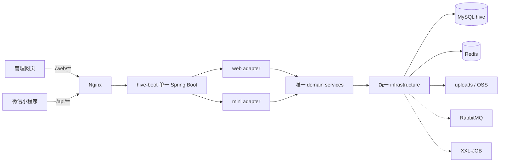

# Hive 双后端合并可行性评估

> 评估日期：2026-07-13。本文为静态源码、已有构建产物与部署包分析，不代表已完成合并、编译、容器演练或生产验证。

## 0. 执行结论

### 0.1 总结

- 将管理端后端与小程序后端合并为一个 Spring Boot 进程，**技术上可行**。两端已经使用相同的 Spring Boot/Java 基线，并共享 MySQL、Redis、上传目录和公共模块，基础设施不存在不可跨越的障碍。
- 当前代码**不适合直接合并**。如果只把 `my.management` 与 `my.hive_back` 一起加入 component scan，会同时触发同名 Bean、重复 Mapper、重复 `@Bean`、重复路由以及两套互不等价的认证/租户策略。
- 网页端 `/web/**` 和小程序 `/api/**` 可以保持兼容，但必须把两个前缀提升为合并后应用的一等接口边界，不能再依赖两个不同的 `server.servlet.context-path`。
- 推荐路线是：**短期继续双后端，中期建设模块化单体，完成契约测试和分路由切流后再停旧进程**。

### 0.2 Go / No-Go

| 方案 | 结论 | 原因 |
| --- | --- | --- |
| 直接合并源码并扩大扫描范围 | **NO-GO** | 至少 63 个同简单名候选 Bean、61 个相同 HTTP 方法与相对路径、token/XXL-JOB 单例配置冲突，且源码与发布 jar 基线未完全对齐。 |
| 模块化单体 | **条件 GO，推荐目标** | 能保留 `/web`、`/api` 两套适配层，同时逐步收敛领域 Service、Mapper 和基础设施；必须按阶段实施并保留双后端回滚窗口。 |
| 继续双后端 | **当前 GO** | 生产风险最低；先补构建可重复性、公共包版本治理、认证版本和 API 契约测试，再决定切流日期。 |

## 1. 证据范围与引用规则

本文涉及四个独立根目录。为避免文档绑定某台机器，后续文件均使用各自根目录内的相对路径：

| 标记 | 根目录含义 | 示例 |
| --- | --- | --- |
| `[management]` | HiveManager 仓库 | `management/src/main/resources/application.yaml` |
| `[mini]` | 小程序后端仓库 | `src/main/resources/application.yaml` |
| `[common]` | 公共模块仓库 | `src/main/java/my/hive/common/utils/TokenUtil.java` |
| `[deploy]` | 部署包根目录 | `docker-compose.yml`、`nginx/nginx.conf` |

本次检查范围：

- `[management] management/pom.xml`、启动类、Controller、Service、Mapper、配置、测试。
- `[mini] pom.xml`、启动类、Controller、Service、Mapper、配置、测试。
- `[common] pom.xml`、自动配置、认证、租户、打印、日志、Redis、存储能力。
- `[deploy] docker-compose.yml`、Nginx、环境变量模板、Dockerfile、迁移清单、发布与回滚脚本。

边界说明：本次未运行 Maven build/test，因为 Maven 会写入 `target`；本机没有 Docker CLI，未执行 `docker compose config`、容器启动或 MySQL 迁移演练。因此本文中的“存在”“冲突”“兼容”均为静态证据结论，生产状态仍需通过后续门槛验证。

## 2. 现状证据

### 2.1 Maven、启动类与扫描边界

| 项目 | 证据 | 现状 |
| --- | --- | --- |
| 管理端 | `[management] management/pom.xml` | Spring Boot 3.1.8、Java 21、jar；依赖 `my.hive:hive-backend-common:0.1.0`。 |
| 小程序端 | `[mini] pom.xml` | Spring Boot 3.1.8、Java 21、jar；依赖相同的公共模块版本。 |
| 公共模块 | `[common] pom.xml` | Spring Boot 3.1.8、Java 21；提供 Web、AOP、Redis、AMQP、JDBC、MyBatis-Plus 等传递能力。 |

启动与扫描证据：

- `[management] management/src/main/java/my/management/ManagementApplication.java`：`scanBasePackages = "my.management"`，Mapper 扫描 `my.management.module.**.mapper`，显式导入 `HiveCommonAutoConfiguration`。
- `[mini] src/main/java/my/hive_back/HiveBackApplication.java`：`scanBasePackages = "my.hive_back"`，Mapper 扫描 `my.hive_back.module.**.mapper`，显式导入相同公共自动配置，并启用 `@EnableAsync`。
- `[common] src/main/java/my/hive/common/autoconfigure/HiveCommonAutoConfiguration.java`：扫描整个 `my.hive.common`，因此公共 Controller、切面、异常处理、打印服务、操作日志消费者等都会进入两个应用。

当前扫描隔离是两个应用都能启动的重要前提。把两个业务包直接放入同一个 `ApplicationContext` 会移除这层隔离。

### 2.2 端口、Context Path 与网关

| 入口 | 应用配置 | Nginx 路由 |
| --- | --- | --- |
| 管理网页 API | `[management] management/src/main/resources/application.yaml`：端口 `8081`，context path `/web` | `[deploy] nginx/nginx.conf`：`/web/` 转发到 `management-backend-1:8081` |
| 小程序 API | `[mini] src/main/resources/application.yaml`：端口 `8080`，context path `/api` | `[deploy] nginx/nginx.conf`：`/api/` 转发到 `backend-1:8080` |
| 本地上传 | 两端均注册 `/uploads/**` ResourceHandler | `[deploy] nginx/nginx.conf`：外部 `/uploads/` 重写为管理端 `/web/uploads/` |

当前 Controller 本身多数只声明 `/auth`、`/approval`、`/inventory` 等相对路径。真正避免冲突的是两个不同的 context path，不是 Controller 的包名。

### 2.3 数据库、Redis、RabbitMQ 与文件

- 两端开发配置均连接 `jdbc:mysql://localhost:3306/hive`，Redis DB 4。
- `[deploy] docker-compose.yml` 中两个生产后端均连接 MySQL 数据库 `hive`、Redis DB 0，并使用相同 `HIVE_REDIS_NAMESPACE`、`HIVE_REDIS_ENV`。
- 两个后端挂载同一个 `[deploy] uploads` 目录，所以历史本地附件不需要搬迁；但合并后仍需保持已有 URL 解析规则。
- RabbitMQ 主要用于 `[common] src/main/java/my/hive/common/log/OperationLogRabbitConsumer.java` 的操作日志；compose 默认可使用内存队列并把 RabbitMQ 作为 profile。
- system event 由 `[common] src/main/java/my/hive/common/event/JdbcSystemEventPublisher.java` 写数据库，不是跨后端 RPC。
- 源码中未找到 Spring WebSocket starter、`@ServerEndpoint`、`@MessageMapping` 或 WebSocket handler；当前 Nginx 也没有 Upgrade 转发。现阶段不存在需要合并的 WebSocket 服务。

### 2.4 业务耦合方式

两端没有 Feign、RestTemplate 或 WebClient 形式的后端互调。耦合主要通过以下共享状态发生：

1. 同一组业务表，例如 `user`、订单、审批、库存、打印任务、租户与权限表。
2. 同一 Redis 实例，但管理端和小程序权限缓存使用不同业务前缀。
3. 同一 token secret、公共响应加密与公共权限切面。
4. 同一上传卷或 OSS bucket。
5. 同一个 XXL-JOB Admin，但当前注册为两个 executor。

这种结构说明“单进程”可行，也说明简单拼接风险很高：两端不是独立微服务，而是共享数据库上的两套接口与领域实现。

## 3. 冲突清单

### 3.1 Bean 名称冲突

按 Spring 默认 bean name 和 MyBatis Mapper 默认命名静态统计，两个业务包之间至少有 63 个同简单名候选 Bean。

重复 Controller 10 个：

`ApprovalController`、`AuthController`、`BadProductController`、`CustomerController`、`DocumentController`、`EquipmentController`、`InventoryController`、`LabelTemplateController`、`NotificationController`、`OrderController`。

重复 Service 13 个：

`ApprovalAuditorCandidateService`、`ApprovalDefaultAuditorService`、`AuthService`、`BadProductService`、`CustomerService`、`DocumentService`、`EquipmentService`、`InventoryService`、`InventorySettingService`、`InventoryWarningCacheService`、`LabelTemplateService`、`OrderService`、`OssStorageService`。

重复 Mapper 33 个：

`ApprovalAuditorCandidateMapper`、`ApprovalDefaultAuditorMapper`、`AttendanceRecordMapper`、`BadProductMapper`、`ClothMapper`、`ClothModelSpecMapper`、`CustomerContactMapper`、`CustomerMapper`、`CustomerProjectMapper`、`DocumentMapper`、`EmployeeAttendanceLocationMapper`、`EquipmentDeviceMapper`、`EquipmentInspectionRecordMapper`、`FinanceApprovalMapper`、`InstallationTaskMapper`、`InventoryRecordMapper`、`InventorySettingMapper`、`LabelTemplateMapper`、`LeaveMapper`、`OutboundItemMapper`、`OutboundOrderMapper`、`PriceSkuMapper`、`ProductionOrderMapper`、`ProductionOrderStatusLogMapper`、`ResignationApprovalMapper`、`SalesOrderDetailMapper`、`SalesOrderMapper`、`SalesOrderStatusLogMapper`、`SysPermissionMapper`、`SysRoleMapper`、`SysRolePermissionMapper`、`SysUserRoleMapper`、`TenantMapper`。

重复配置或基础 Bean 包括：

- `WebMvcConfig` / `webMvcConfig`。
- `MybatisPlusConfig` / `mybatisPlusConfig`。
- `XxlJobConfig` / `xxlJobConfig`。
- 两个 `@Bean mybatisPlusInterceptor`。
- 两个 `@Bean xxlJobExecutor`。
- `BoundedTenantProperties`、`OssStorageProperties`、`OssStorageService`、`CodeGeneratorUtil`、`TenantFeatureAspect`。

仅改用全限定 BeanNameGenerator 可以绕过一部分启动冲突，但不能解决重复路由、两套 MyBatis 拦截器、两套 XXL executor 端口以及重复领域逻辑，因此不能作为最终方案。

### 3.2 路由冲突

静态扫描得到管理端约 175 个、小程序端约 82 个 HTTP endpoint，其中 61 个“HTTP 方法 + 相对路径”完全相同。主要冲突组：

| 路由组 | 重合情况 |
| --- | --- |
| `/auth` | `POST /auth/login`、`POST /auth/join-organization` 重合；公开路径和登录模型不同。 |
| `/approval` | summary、auditors、请假、财务、离职、质量和订单审批的大部分查询/审核路径重合。 |
| `/bad-product` | list、save、process、附件上传下载几乎全部重合。 |
| `/document` | list、folder/create、file/upload、rename、move、breadcrumbs 全部重合。 |
| `/inventory` | 入库、出库、识别、型号、趋势、最近记录、预警列表等多条重合。 |
| `/label-template` | list、variables、default、detail、save、upload、设默认、删除全部重合。 |
| `/customer`、`/equipment`、`/notifications` | 多条列表、详情和提交接口重合。 |

订单入口有部分差异：管理端基路径是 `/order`，小程序端是 `/orders`，但它们仍操作同一订单域和数据库表。

#### PrintTaskController

曾出现的打印 Controller 冲突当前已经通过公共模块收口：

- `[common] src/main/java/my/hive/common/print/PrintTaskController.java` 唯一声明相对路径 `/print-task`。
- `[management] management/src/test/java/my/management/architecture/CommercialHardeningStaticTest.java` 明确要求管理端不得再创建本地打印 Controller。
- `[mini] src/test/java/my/hive_back/architecture/CommercialHardeningStaticTest.java` 对小程序端作同样约束。

在双后端下，相同公共 Controller 自动形成 `/web/print-task/**` 与 `/api/print-task/**`。合并后如果取消 context path，只映射一次 `/print-task/**` 会破坏两个客户端；目标架构必须显式提供两个兼容入口，并复用同一个 `PrintTaskService`。

### 3.3 实体与 Mapper 冲突

两个后端至少有 19 张显式 `@TableName` 映射表重合：审批候选人、默认审批人、坏品、布料型号、考勤地点、离职审批、设备、设备检查、财务审批、安装任务、库存配置、标签模板、出库单、生产/销售订单与状态日志等。

重点实体漂移：

| 表 | 差异 |
| --- | --- |
| `user` | 管理端建模为 `Employee`，包含 `mustChangePassword`、`managerName` 等；小程序建模为 `User`。两端登录、权限和审批人查询直接依赖此表。 |
| `installation_task` | 管理端多施工人员、电话、备注、特殊异常说明、附件和验收时间等字段。 |
| `outbound_order` | 管理端多项目、打印日期、物流、打印操作人和编辑次数；小程序侧另有 `bizOrderNo`。 |
| `outbound_item` | 管理端多 `remark`。 |
| `employee_attendance_location`、`tenant_attendance_location` | 管理端模型包含额外时间字段。 |
| `sales_order` | 小程序模型包含额外更新人字段。 |

不能以“类名相同”判断实现可直接合并。目标状态应当是一张表对应一个权威实体和 Mapper；网页/小程序差异留在查询投影、DTO 和 adapter 中。

### 3.4 MyBatis 与租户上下文冲突

- `[management] management/src/main/java/my/management/common/config/MybatisPlusConfig.java` 注册 TenantLine + Pagination。
- `[mini] src/main/java/my/hive_back/common/config/MybatisPlusConfig.java` 注册 TenantLine + OptimisticLocker + Pagination。
- 两端均通过 `[common] TenantPermissionContext` 提供 tenantCode/userId/permission，并在请求完成后清理 ThreadLocal。

合并后必须只保留一个 `MybatisPlusInterceptor`，明确插件顺序，并覆盖管理端现有 `@Version` 实体的回归测试。两套 WebMvc interceptor 绝不能同时匹配同一请求，否则会覆盖或提前清理共享 ThreadLocal。

### 3.5 token、登录与权限冲突

共同基础：

- `[common] src/main/java/my/hive/common/utils/TokenUtil.java` 使用 HMAC token，配置来自 `auth.token.secret` 和 `auth.token.expire-hours`，内部是静态运行时状态。
- `[common] src/main/java/my/hive/common/advice/ResultEncryptAdvice.java` 对携带 Bearer token 的 `Result` 响应加密。
- `[common] src/main/java/my/hive/common/aop/PermissionAspect.java` 从 `TenantPermissionContext` 执行权限校验。

端侧差异：

| 范围 | 管理端 | 小程序端 |
| --- | --- | --- |
| 登录 | 账号/手机号、密码重置、加入组织、扫码登录、平台账号 | 账号登录、微信登录、加入组织、当前用户 |
| token TTL | 默认 24 小时 | 部署配置 `MINI_AUTH_TOKEN_EXPIRE_HOURS` 默认 720 小时 |
| token header | 强制 `Authorization: Bearer` | Bearer 为主；开发模式可允许本地 legacy header |
| 租户检查 | 允许 `super` 平台租户；检查许可证 | 检查 bounded tenant、租户状态和订阅有效期 |
| 权限缓存 | `management/perm-v2` | `mini/perm-v2`；管理端失效逻辑会同时删除两端 key |

一个 JVM 中当前 `TokenUtil` 只能有一个 TTL。若简单选择 24 小时，会改变小程序长期登录体验；选择 720 小时会扩大网页 token 风险。目标实现应把“验签”和“签发策略”拆开，为 web/mini 分别传入 TTL 或 audience，同时保持现有 secret 和旧 token 的过渡兼容。

此外，公共模块源码已经出现 `authVersion` 演进，而检查到的两个应用源码/部署 jar 仍有旧两参数签发调用。`[deploy] db-migrations/migrations/V20260713_003_permission_catalog_v3.sql` 又新增 `user.auth_version`。这项演进必须先形成同一可构建基线，不能与后端合并同时无保护上线。

### 3.6 审批、订单、上传、作业与消息冲突

#### 审批与订单

- `[management] management/src/main/java/my/management/module/approval/service/ApprovalService.java` 同时依赖请假、财务、离职、质量、订单、员工、考勤、审批人服务。
- `[mini] src/main/java/my/hive_back/module/approval/service/ApprovalCenterService.java` 操作同一批表，但拆分为 `SalesOrderService`、`ProductionOrderService`、`ApprovalAccessService` 等实现。
- 两端订单/审批大量使用 `@Transactional`，合并后虽可继续使用同一 DataSource 事务，但状态机、并发锁、审批人决策和打印任务副作用必须逐条证明等价。

#### 文件上传

- 管理端本地上传根据 `server.servlet.context-path` 生成 `/web/uploads/...`。
- 小程序图片服务生成 `/uploads/...`。
- Nginx 当前把外部 `/uploads/...` 重写到管理端 `/web/uploads/...`，两个容器共享上传卷。

合并后要同时支持历史 `/web/uploads/**` 与 `/uploads/**`，并继续使用公共 `TenantUploadResourceResolver` 做租户路径约束。不能因取消 context path 改变数据库中已有附件 URL。

#### XXL-JOB

- 两端各有同名 `XxlJobConfig` 和 `xxlJobExecutor` Bean。
- `[deploy] docker-compose.yml` 当前配置 `hive-management:9999` 与 `hive-mini:9998` 两个 executor。
- 管理端 handler：`runtimeStabilityAuditJob`、`dbCapacityReportJob`、`dbCleanupJob`、`notificationClosedLoopJob`。
- 小程序 handler：`attendanceDailyStatJob`、`inventoryDailyStatJob`。
- `[deploy] db-migrations/migrations/V20260429_004_xxl_job_scheduler.sql` 和后续修复脚本把作业固定到两个 group。

目标单体应注册一个 `hive-unified` executor，并通过幂等迁移重绑六个 handler。切流期间必须保证新旧 executor 不会同时领取同一业务作业。

#### 消息与异步

- RabbitMQ 没有发现订单等核心业务事件，仅有公共操作日志消费。
- 合并后操作日志消费者从两个进程变为一个，不需要数据迁移，但需验证无积压、无重复写入。
- 小程序库存服务存在 `@Async`，当前通过参数显式传 tenantCode。合并 Executor 后仍需验证异步线程不错误继承或丢失租户上下文。

## 4. 构建与发布物一致性风险

`[deploy] RELEASE_BUILD_INFO.txt` 固定了管理端、公共模块和小程序后端的发布 commit，并记录两个部署 jar 使用相同的公共 jar SHA256。静态检查同时发现：

1. 当前源码工作树、当前 `target` 公共 jar 和部署包内嵌公共 jar 不完全一致。
2. 当前公共源码的 token API 已向 `authVersion` 演进，检查到的部署 jar 仍是旧接口。
3. 管理端订单/审批源码存在晚于发布包的变更。
4. `[common] VERSIONING.md` 已规定公共 API 或自动配置变化必须升版本，但两个业务 pom 仍固定使用 `0.1.0`。

因此合并项目的第一个交付物不是统一启动类，而是“同一 commit 集合可重复构建出同一 hash”的 reactor 基线。否则无法判断合并故障来自架构改造还是旧制品漂移。

## 5. API 兼容性判断

### 5.1 可以兼容的条件

网页端和小程序 API 可以保持不改客户端，条件是：

1. 外部路径继续是 `/web/**` 与 `/api/**`。
2. HTTP 方法、状态码、`Result` JSON、加密响应和 renewed-token header 保持不变。
3. web/mini 公开登录路径、租户策略和权限缓存语义仍分开。
4. `/web/print-task/**` 与 `/api/print-task/**` 都可用。
5. `/web/uploads/**` 与 `/uploads/**` 均兼容历史 URL。
6. token 签发 TTL 保留端侧差异，旧 token 在过渡期继续可验证。
7. Nginx 在切流前后不改变客户端可见 URL。

### 5.2 不推荐的兼容实现

- 不推荐给统一应用设置单一 `/web` 或 `/api` context path。
- 不推荐只靠 Nginx 去掉前缀后把两组请求送入同一 DispatcherServlet，因为相对 Controller 路由仍然冲突。
- 不推荐把所有同名 Bean 改成全限定名称后直接上线；这只解决注册名，不解决行为重复。
- 不推荐在第一阶段删除任一端 Controller。先保留 adapter 契约，再收敛底层 Service。

## 6. 三种方案比较

| 维度 | 直接合并 | 模块化单体 | 继续双后端 |
| --- | --- | --- | --- |
| 上线速度 | 表面最快，实际会被 Bean/路由冲突阻断 | 中等，按模块逐步完成 | 无迁移成本 |
| API 兼容 | 风险高 | 可通过 web/mini adapter 保证 | 当前已兼容 |
| 领域重复 | 基本保留且更难辨认 | 可逐步消除 | 持续存在 |
| 故障域 | 两端立即绑定 | 最终单故障域，但有灰度过程 | 两端可独立回退 |
| 资源占用 | 最低 | 低；可按统一负载设置堆 | 两个 JVM，开销最高 |
| 部署复杂度 | 单容器，但迁移风险集中 | 最终单容器；过渡期三容器 | 当前脚本成熟 |
| 长期维护 | 差 | 最佳 | 中等偏差，跨仓库协同成本持续 |
| 当前建议 | **NO-GO** | **条件 GO** | **短期 GO** |

## 7. 推荐目标架构：模块化单体

```text
hive-parent
├─ hive-boot
│  └─ 唯一启动类、统一配置、单一可执行 jar
├─ hive-domain
│  └─ 用户、租户、权限、订单、审批、库存等唯一领域模型和服务
├─ hive-infrastructure
│  └─ MySQL、MyBatis、Redis、OSS、本地文件、RabbitMQ、XXL-JOB
├─ hive-adapter-web
│  └─ /web/** Controller、管理端 DTO、平台账号与网页登录策略
├─ hive-adapter-mini
│  └─ /api/** Controller、小程序 DTO、微信与移动端登录策略
└─ hive-common
   └─ Result、异常、权限注解、通用工具；不放端侧 Controller
```



关键约束：

- 单端口、根 context path；类级别显式声明 `/web` 或 `/api`。
- 一个表对应一套权威 Entity/Mapper；端侧字段差异用 projection/DTO 表达。
- 一个 `MybatisPlusInterceptor`，一个 Redis namespace builder，一个文件 resolver。
- token 验签统一、签发策略按客户端区分，租户/权限拦截按路由区分。
- `PrintTaskService` 保持共享，打印 Controller 移到 adapter 或用双路径映射，不再由基础 common 隐式提供端侧 API。
- 一个 XXL executor；所有 job handler 名保持不变，减少数据库迁移范围。

## 8. 分阶段计划与回滚点

| 阶段 | 主要工作 | 交付门槛 | 回滚点 | 估算 |
| --- | --- | --- | --- | --- |
| 0. 冻结可重复基线 | 固定三个源码 commit、公共版本和发布 jar hash；完成 `authVersion` 演进对齐；建立 reactor 构建 | 同一输入重复构建得到一致依赖与 jar；两个旧应用仍可启动 | 无生产变更，继续双后端 | 3-5 人日 |
| 1. 契约保护 | 为 `/web`、`/api` 建路由快照、MockMvc/HTTP 契约测试；补 Spring Context 启动测试 | 当前双后端契约测试通过；可检测 Bean/路由重复 | 只新增测试，不切流 | 5-8 人日 |
| 2. 单体外壳 | 建 `hive-boot`、两个 adapter；显式前缀；合并 WebMvc、MyBatis、Redis、文件和公共配置；业务 Service 暂保留两套 | unified 在 `allow-bean-definition-overriding=false` 下启动，所有兼容路由存在 | 删除 shadow 应用，旧服务不变 | 7-10 人日 |
| 3. 领域收敛 | 依次合并用户/权限、租户、订单/审批、库存/打印、文件；每次只收敛一个表簇 | 单模块契约、事务、并发和租户测试通过 | adapter 可回退到原 Service；原表和旧容器保留 | 15-25 人日 |
| 4. 分路由灰度 | 上线 unified shadow；先把 `/api/` 切到 unified，稳定后再切 `/web/` | 每次切流均通过 smoke、日志、DB/Redis 指标和业务验收 | 单独修改 Nginx location 回旧 upstream | 5-8 人日 |
| 5. 作业与部署收口 | 迁移 XXL group；确认无重复执行；compose 改为一个正式后端；更新发布/回滚脚本 | 六个 handler 单次执行，旧 executor 停止注册，整包回滚演练通过 | 恢复 XXL group，启动旧两个容器并回切 Nginx | 3-5 人日 |

阶段 3 与阶段 4 的部分工作可交错，但不能在同一次发布中同时变更 URL、token、订单状态机、数据库列和调度归属。

## 9. 部署变化

### 9.1 docker-compose 与 Nginx

- `[deploy] docker-compose.yml` 将 `backend-1` 与 `management-backend-1` 合并为 `hive-backend-1`；灰度期间保留旧服务并通过 profile 或独立 override 控制。
- `/api/`、`/web/` 最终指向同一 upstream，但灰度时允许两个 location 分别回切。
- 保留同一个 `uploads` volume；统一日志目录后更新容量和清理脚本。
- 单 JVM 的堆不能继续机械使用任一旧服务的 `-Xmx192m`。初始容量应根据双端峰值压测设置，再验证合并后的 JVM/Metaspace 节省。

### 9.2 环境变量

统一服务需要两个旧服务变量的并集，并明确解决以下冲突：

- `AUTH_TOKEN_EXPIRE_HOURS`：改为 web/mini 两套签发策略。
- `SYSTEM_EVENT_SOURCE_APP`：改为显式事件来源或统一 `hive-unified`，不能让全局属性错误标记端侧来源。
- `XXL_JOB_*`：两个 app name/port 合为一个 executor 配置。
- `LOGGING_FILE_NAME`：单文件或按 logger package 分 appender。
- CORS exposed headers 取两端并集，保留 `Authorization` 与 renewed-token headers。

### 9.3 jar、脚本与迁移

- 两个 Dockerfile 合为一个，复制唯一可执行 jar。
- `[deploy] scripts/rollback-release.sh`、`scripts/smoke-test.sh`、`scripts/rebuild-all.sh` 等至少 30 个文件引用了双后端服务名、容器名或目录，需要同步修改。
- 仅为“一个进程”不需要迁移业务表，因为两端已经共享数据库。
- 需要新增幂等 XXL group 重绑迁移；旧 group 在回滚窗口内保留。
- 最新订单字段与 `auth_version` 迁移必须先独立完成并验证，不能隐藏在合并发布中。

## 10. 测试门槛

### 10.1 构建与启动

- Maven reactor clean build，可重复产出唯一公共依赖和唯一 boot jar。
- dependency convergence，无两个不同内容却同为 `0.1.0` 的公共 jar。
- `spring.main.allow-bean-definition-overriding=false` 下 ApplicationContext 启动成功。
- Controller mapping 快照不存在重复 handler；保留全部 `/web`、`/api` 入口。
- MyBatis 扫描只注册一套权威 Mapper，不依赖同名覆盖。

### 10.2 认证、权限与租户

- 网页密码登录、重置、加入组织、扫码登录、平台账号。
- 小程序账号登录、微信登录、手机号、加入组织、当前用户。
- web 24 小时与 mini 720 小时签发策略、续签 header、响应加密、旧 token 兼容期。
- `authVersion` 变化后旧 token 失效；密码修改、权限变化和账号停用路径覆盖。
- `super` 只能访问 `/web/platform/**`；普通租户不能访问平台入口。
- bounded tenant、禁用/过期租户、FIELD 租户 SQL、异常和异步后的 ThreadLocal 清理。
- 管理端权限变更同时清理 management/mini 两套缓存 key。

### 10.3 业务回归

- 审批提交、通过、拒绝、并行审批人、并发重复提交和事务回滚。
- 销售/生产订单创建、状态推进、回退、扫码流转、安装任务同步。
- 坏品、财务、请假、离职和质量审批的双端查询与审核结果一致。
- 库存乐观锁、入出库幂等、异步趋势缓存和租户字段。
- PrintTask 创建、复用、待打印、上报、权限和双入口。
- 权限拒绝、用户级 DENY、角色更新后的两端即时一致性。

### 10.4 文件、调度、消息与部署

- `/web/uploads/**`、`/uploads/**`、历史数据库 URL、本地文件和 OSS。
- 路径穿越、跨租户、扩展名、Content-Type、文件大小限制。
- 六个 XXL handler 各执行一次，无新旧 executor 双跑。
- RabbitMQ 开启/关闭、内存队列降级、操作日志无重复或丢失。
- system event 来源与异常事件正确。
- Nginx `/api`、`/web`、`/uploads`、TLS、30MB 上传、超时和回切。
- shadow 数据库迁移、schema verify、备份恢复、旧 jar/旧容器整包回滚。

当前没有 WebSocket 实现，合并验收应确认相关路径仍为未提供；如果后续新增 WebSocket，必须单独增加 Nginx Upgrade、连接鉴权和长连接容量测试，不应混入本次合并范围。

## 11. 工作量估算

| 工作包 | 人日 |
| --- | ---: |
| 构建与发布基线对齐 | 3-5 |
| API/启动/租户契约测试 | 5-8 |
| 模块化单体外壳与基础设施收敛 | 7-10 |
| 用户、权限、订单、审批、库存等领域收敛 | 15-25 |
| 灰度、部署脚本、XXL 迁移和回滚演练 | 8-12 |
| **合计** | **38-60 人日** |

该估算以一名熟悉现有业务的高级后端工程师为基准，并包含必要 QA/部署协作但不包含新功能开发。仅实现“能启动的一体 jar”约需 10-15 人日，但会保留大量重复 Service/Mapper 和不可接受的长期风险，不建议作为生产完成标准。

## 12. 主要风险与决策门槛

| 风险 | 严重度 | 控制措施 |
| --- | --- | --- |
| 源码、公共 jar、部署 jar 不同源 | 高 | 阶段 0 固定 commit/hash，reactor 一次构建全部模块。 |
| 61 个重复相对路由 | 高 | 显式 `/web`、`/api` adapter；mapping 快照测试。 |
| 认证 TTL/`authVersion` 同时变化 | 高 | 先独立完成认证版本演进，再做单体；保留旧 token 兼容期。 |
| 订单/审批双实现语义漂移 | 高 | 按表簇收敛，增加事务、并发和状态机测试。 |
| XXL 作业双跑 | 高 | 分阶段迁移 group，新旧 executor 互斥，保留回绑 SQL。 |
| 单进程扩大故障域 | 中高 | `/api`、`/web` 分路由灰度；旧容器和镜像保留完整回滚窗口。 |
| 历史上传 URL 失效 | 中 | 双 URL handler、共享卷不迁移、全量附件抽样验证。 |
| 单体资源估算不足 | 中 | 合并前压测，按峰值设置堆并监控 GC/Metaspace/线程池。 |

进入生产切流前必须同时满足：

1. 公共模块不存在同版本不同内容，三个源码基线可重复构建。
2. 全量 Context、路由、认证、租户、订单/审批和上传测试通过。
3. `/api`、`/web` 可独立回切到旧服务。
4. XXL-JOB 无双跑，数据库备份与恢复演练完成。
5. 观察期内错误率、延迟、Redis/MySQL 指标和 JVM 资源不劣于双后端基线。

在这些条件满足前，最终结论保持：**直接合并 NO-GO；继续双后端 GO；模块化单体作为分阶段、可回滚的条件 GO 目标。**
